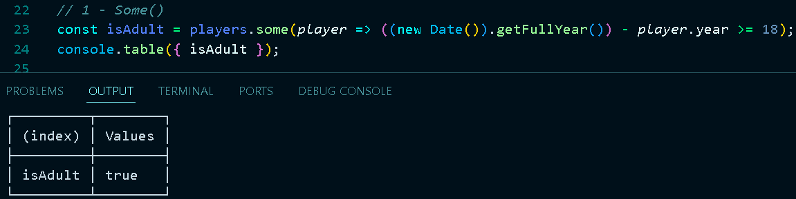
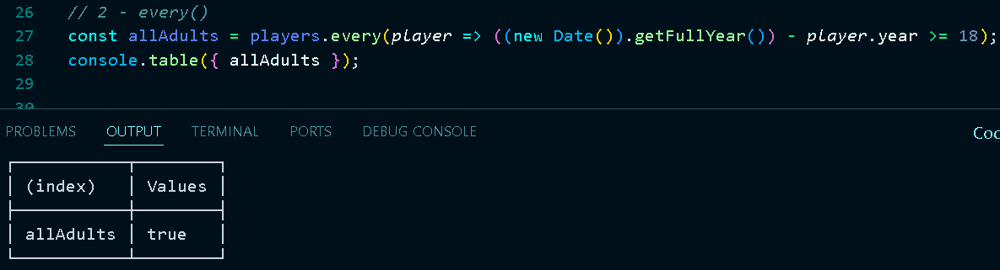
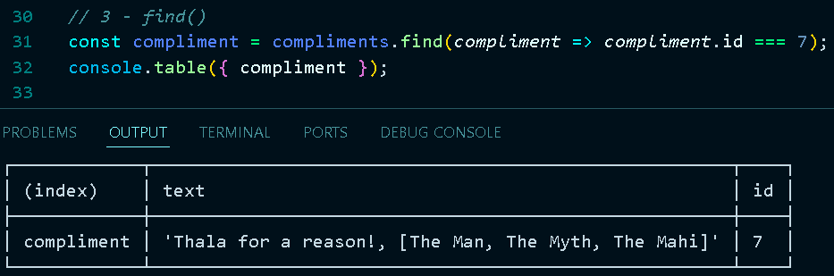
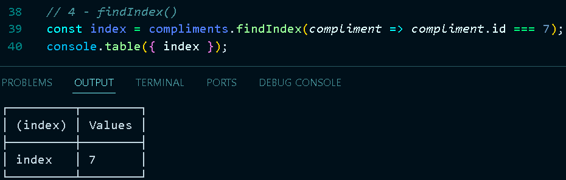
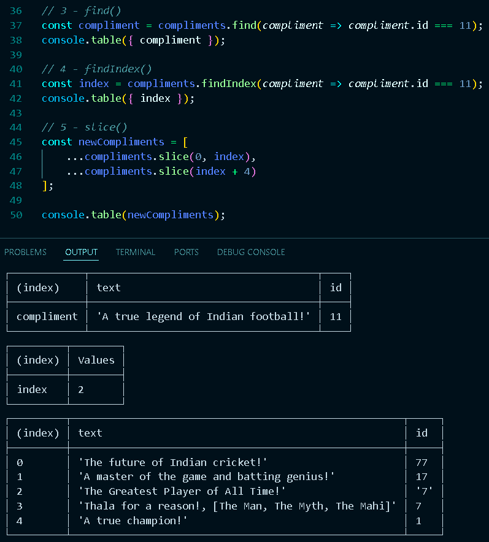
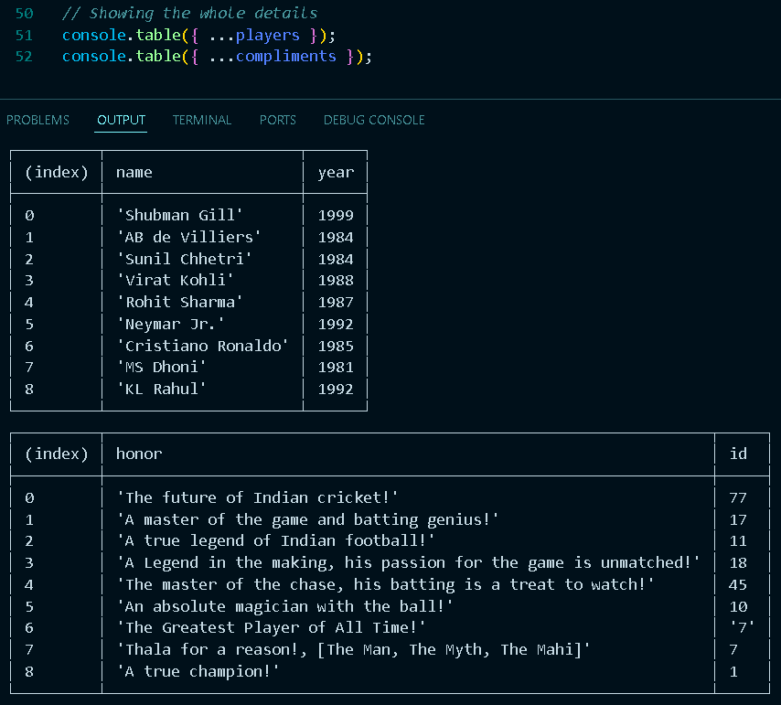

# 🚀 30 Days of JavaScript Challenge - Day 6: Array Cardio - Part 2

Welcome to Day 6 of my **30 Days of JavaScript Challenge**! In this section, I focused on advanced array methods that are essential for efficient data manipulation in JavaScript.

## Overview

During this challenge, I explored several array methods, including `some()`, `every()`, `find()`, `findIndex()`, and `slice()`. Each method has its unique utility, allowing for robust data handling and manipulation. Below is a summary of what I accomplished today:

### Key Array Methods Explored:

1. **Some()**:  
   - I checked if at least one player is an adult, demonstrating how to evaluate conditions within an array. This method is perfect for quick checks!
   

2. **Every()**:  
   - I validated whether all players are adults, reinforcing my understanding of how to apply universal conditions across arrays.
   

3. **Find()**:  
   - I utilized the `find` method to retrieve specific compliments based on their IDs. This helped me sharpen my skills in searching for data points effectively.
   

4. **FindIndex()**:  
   - I learned how to locate the index of a specific compliment, enhancing my ability to work with array structures.
   

5. **Slice()**:  
   - I practiced slicing arrays to create new arrays by excluding certain elements, showcasing the flexibility of JavaScript arrays.
   

### Displaying Data

- I showcased all player and compliment details using `console.table`, which made the data easy to read and analyze.
   

## Resources

A special thanks to [Wes Bos](https://wesbos.com/) for his incredible resources and guidance that inspire me to keep pushing my skills! 🙌

## Repository

You can find my code for this challenge in the following link:

- [JavaScript Challenge 30 - Day 6](https://github.com/Ash-dot-coder/JavaScript_Challenge30/tree/Js30/Day%2006%20-%20%5BArray-Cardio%202%5D)

Stay tuned for more updates as I progress through my challenge! 💻🚀

## Contact

Feel free to connect with me on [LinkedIn](https://www.linkedin.com/in/aayush-kohre-dev1/) or explore more of my projects on GitHub.

---

Happy coding! 🌟
