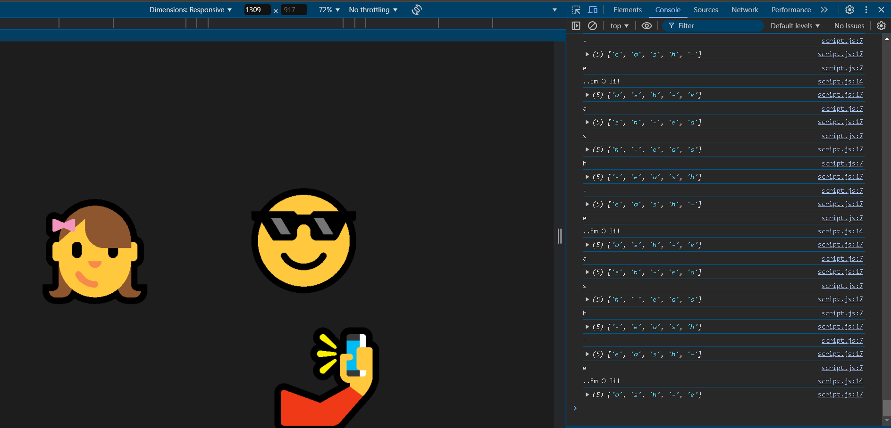
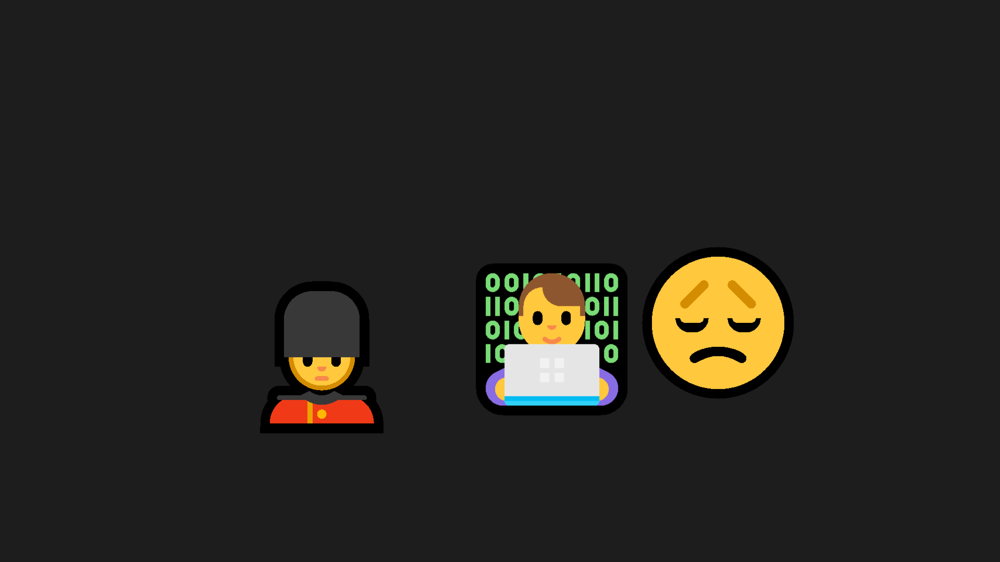

# 👨‍💻 Day : 7 - Mystery Emoji Drop 🔧



## 📖 Overview

**Mystery Emoji Drop** is an interactive web application developed as part of my 30-Day JavaScript Challenge. This project brings an element of surprise and engagement to users by allowing them to trigger animated emojis on the screen by entering a specific key sequence. 🎈

## 🗂 Table of Contents

- [👨‍💻 Day : 7 - Mystery Emoji Drop 🔧](#-day--7---mystery-emoji-drop-)
  - [📖 Overview](#-overview)
  - [🗂 Table of Contents](#-table-of-contents)
  - [✨ Features](#-features)
  - [🛠 Technologies Used](#-technologies-used)
  - [🚀 How to Run the Project](#-how-to-run-the-project)
  - [🔍 Key Sequence Detection](#-key-sequence-detection)
  - [🎥 Demo](#-demo)
  - [💡 Potential Applications](#-potential-applications)
  - [🙏 Acknowledgments](#-acknowledgments)
  - [📧 Contact](#-contact)

## ✨ Features

- **Key Sequence Detection**: Enter a predefined key sequence to trigger the emoji animations. This makes the application engaging and fun! 🎮
- **Dynamic Emoji Generation**: Various emojis will fall from different positions on the screen, enhancing the visual appeal. 🌈
- **Smooth Animations**: The emojis drop in a smooth, animated fashion, creating an enjoyable user experience. ✨

## 🛠 Technologies Used

- **HTML**: Structure of the application.
- **CSS**: Styling for a vibrant and attractive layout.
- **JavaScript**: Core functionality for key detection and emoji animations.

## 🚀 How to Run the Project

1. **Clone the repository** to your local machine using the following command:
    ```bash
    git clone https://github.com/Ash-dot-coder/JavaScript_Challenge30.git
    ```

2. **Navigate to the project directory**:
    ```bash
    cd JavaScript_Challenge30/Day\ 07\ -\ [Mystery-Emoji-Drop]
    ```

3. **Open the `index.html` file** in your preferred web browser. 🌍

4. **Interact with the application** by typing the secret code (e.g., `ash-e`) to see the emojis drop! 🎉

## 🔍 Key Sequence Detection

The key sequence detection feature is implemented using JavaScript. The application listens for keyup events and detects a specific code (e.g., `ash-e`). When the correct sequence is typed, the emojis are triggered to fall onto the screen. 🎈

## 🎥 Demo



You can also view the live demo of this project on [GitHub Pages](https://ash-dot-coder.github.io/JavaScript_Challenge30/Day%2007%20-%20%5BMystery-Emoji-Drop%5D/index.html). 🌐

## 💡 Potential Applications

This project can be integrated into various platforms, including:
- **Marketing campaigns**: Engage users with interactive content. 📢
- **Games**: Add fun elements to your game interface. 🎮
- **Social media applications**: Make your platform more engaging. 📱

By adding engaging interactive features, it enhances user experience and encourages participation. 🌟

## 🙏 Acknowledgments

A special thanks to [Wes Bos](https://wesbos.com/) for his invaluable resources and tutorials that inspired this project. His guidance has been instrumental in my journey to mastering JavaScript. 🙌

## 📧 Contact

For inquiries or feedback, feel free to reach out to me:

- **LinkedIn**: [Ayush Kohre](https://www.linkedin.com/in/aayush-kohre-dev1/)
- **GitHub**: [Ash-dot-coder](https://github.com/Ash-dot-coder)