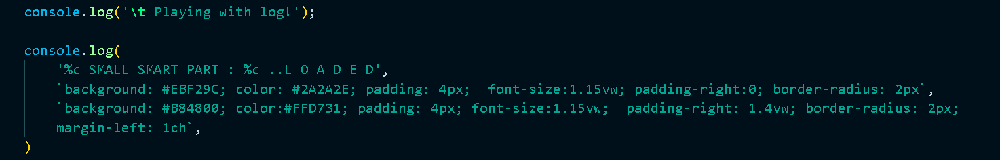
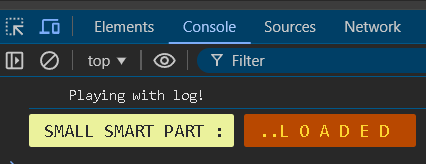

# 🎨 Day 8 - [Interactive Console] 🚀

Welcome to **Day 8** of my **30 Days JS Challenge**! 🎉

## 🔥 Project: Console Style Play

This project, titled **"Console Style Play"**, is part of my journey to explore the various capabilities of JavaScript, especially when it comes to making console logs **interactive**, **stylish**, and **fun**! 🌟

### 💡 Project Highlights:
- 🖥️ **Styled Console Logs:** Using `%c` formatting, I added background colors, paddings, and borders to enhance the console log visuals.
- 🎨 **Dynamic Effects:** The project showcases simple but interactive console messages that bring some creativity and aesthetics into debugging!
- 🚀 **Minimal but Effective:** Even small changes in console logs can create a big difference in understanding and interacting with code.

### 📂 File Structure
- `index.html`: The main HTML file containing the JavaScript script for the console logs.

### 📦 How to Use:
1. Clone the repository:
   ```bash
   git clone https://github.com/Ash-dot-coder/JavaScript_Challenge30.git
    ```

2. Navigate to the project folder:
    ```bash
    cd JavaScript_Challenge30/Day 08 - [Interactive-Console]
    ```

3. Open index.html in your browser and check the console (F12) to see the interactive logs in action!


# 🚀 Tech Stack
- HTML
- JavaScript

# 🌐 Demo
https://ash-dot-coder.github.io/JavaScript_Challenge30/Day%2008%20-%20%5BInteractive-Console%5D/index.html



# 📌 About This Challenge
This project is a part of my 30 Days JavaScript Challenge where I build and explore new JS concepts every day. It’s an excellent way to strengthen my front-end development skills and have fun along the way! 🎯

Feel free to check out other days of the challenge, and stay tuned for more exciting JavaScript experiments! 🚀

