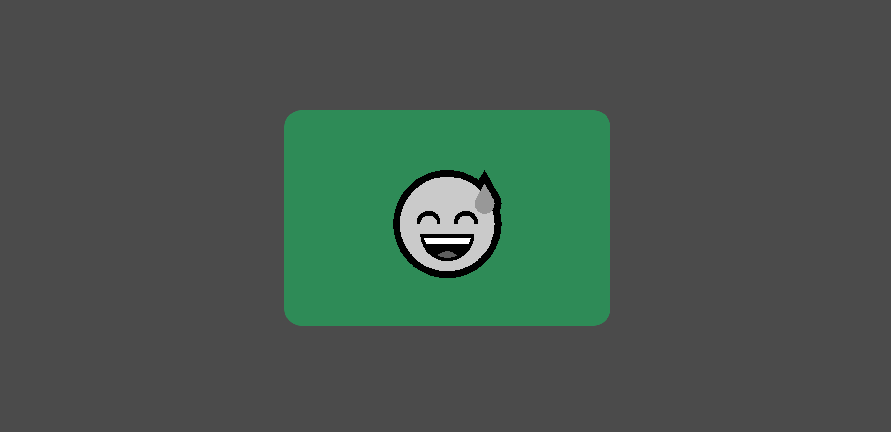

# Day 09 - Random Emojis 🎭

Welcome to **Day 09** of my **30-Day JavaScript Challenge**! In this project, I created a **Random Emoji Changer** where users can interact with an emoji and background color that change dynamically when hovered over. This project was designed to improve my JavaScript skills and understanding of DOM manipulation and event handling.

## Look 💡



## 📝 Project Overview

The **Random Emoji Changer** is a simple, interactive webpage that responds to mouse hover events by:
- Changing the emoji to a randomly selected one from a predefined list.
- Updating the background color dynamically using a predefined set of colors.
- Adding smooth transitions and animations to enhance the user experience.

## 🚀 Technologies Used

This project uses the following technologies:
- **HTML**: To structure the main content and layout of the webpage.
- **CSS**: To style the webpage, add animations, and create smooth transitions for interactive elements.
- **JavaScript**: To implement the emoji and background color changes using event listeners (`mouseover` events).

## 📂 Project Structure

The project is organized as follows:
- `index.html` - The HTML file that defines the structure and main content of the page.
- `style.css` - The CSS file responsible for styling the webpage, including layout, transitions, and animations.
- `script.js` - The JavaScript file that handles the logic for emoji and background color changes upon hover events.

## 🌟 Features

1. **Random Emoji Change**: The emoji changes to a randomly selected one from a list every time the user hovers over it.
2. **Dynamic Background Color**: The background color of the emoji container updates randomly on hover, making the interaction more engaging.
3. **Smooth Transitions**: The emoji and container have smooth scaling and grayscale transitions, giving a playful and lively user experience.

## 🖥️ Demo

You can see the live demo here:
[Random Emoji Changer](https://ash-dot-coder.github.io/JavaScript_Challenge30/Day%2009%20-%20%5BRandom-Emojies%5D/index.html)

## 🛠️ How to Run Locally

To run this project locally:
1. Clone this repository:
   ```bash
   git clone https://github.com/Ash-dot-coder/JavaScript_Challenge30.git
    ```

2. Navigate to the Day 09 - [Random-Emojies] folder:
    ```bash
    cd JavaScript_Challenge30/Day\ 09\ -\ \[Random-Emojies\]
    ```

3. Open the index.html file in your browser.

## 🔧 Future Improvements
- Add more emojis to the collection for more variety.
- Implement additional hover effects and animations.
- Make the layout responsive for different screen sizes.
- Allow the user to click and lock a specific emoji instead of just hovering.

## 📚 What I Learned
- How to manipulate the DOM to create dynamic user interactions.
- The use of JavaScript event listeners (mouseover) to handle real-time changes.
- CSS transitions and animations to create smooth, responsive effects.

## 📝 Contact 
Linkedin ID: [!Ayush Kohre](https://www.linkedin.com/in/aayush-kohre-dev1/)