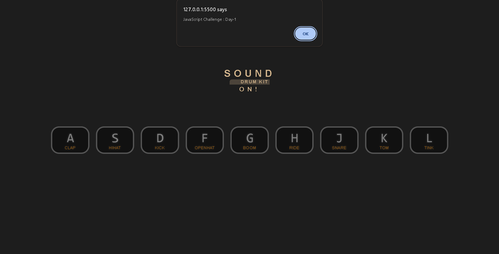

# JavaScript Challenge 30 🚀

Welcome to my **JavaScript Challenge 30**, where I am enhancing my JavaScript skills through various projects over 30 days. Each day focuses on a different project, showcasing different functionalities and learning outcomes.

## Day 1: Drum Kit Project 🎵

Welcome to the **Drum Kit** project, a fun and interactive experience where each letter on your keyboard corresponds to a different drum sound. Press any of the displayed letters to hear the associated sound, creating your own beats!

## 🖥️ Project Preview

Here's a snapshot of the Drum Kit interface:

  
(The above image shows the layout, where pressing any letter key such as **A**, **S**, **D**, etc., triggers drum sounds like clap, hi-hat, kick, etc.)

## 🎯 Key Features

- **Interactive Sound Effects**: Each alphabet key corresponds to a unique drum sound.
- **Visual Feedback**: When a key is pressed, its corresponding button is highlighted, offering a visual cue.
- **Simple Design**: The UI is built to be minimalistic and user-friendly, focusing on the experience of creating beats.
- **Audio Integration**: Enjoy a real-time audio response as you press each key.

## 🛠️ Technologies Used

- **HTML**: Structure and layout of the webpage.
- **CSS**: Styling for the buttons and overall design.
- **JavaScript**: Used to handle the sound effects and interactions with key presses.

## 🎬 Demo

Check out the live demo of the Drum Kit project [Click me](https://ash-dot-coder.github.io/JavaScript_Challenge30/Drum-Kit/index.html).  
Feel free to experience the project and make your own beats!


## 📁 How to Run Locally

To run this project locally, follow these steps:

1. **Clone the repository**:
    ```bash
    git clone https://github.com/Ash-dot-coder/JavaScript_Challenge30.git
    ```
2. **Navigate to the project folder**:
    ```bash
    cd drum-kit
    ```
3. **Open the `index.html` file** in your preferred browser to interact with the drum kit.

## 📂 Project Structure
/drum-kit

│

├── index.html       # Main HTML file

├── styles.css       # Styles for the drum kit layout

├── script.js        # JavaScript functionality and sound handling

└── sounds/          # Folder containing the drum sound files

## 🙏 Acknowledgments

Special thanks to **Wes Bos** for his amazing tools and ideas that inspired me during this project.

## 🛠️ Future Enhancements

- Add more sounds and instruments for a richer experience.
- Implement visual feedback when a key is pressed (e.g., key highlights).


## 📬 Connect With Me

If you have any questions or feedback, feel free to reach out:

- **GitHub**: [ash-dot-coder](https://github.com/Ash-dot-coder)
- **LinkedIn**: [Ayush Kohre](https://www.linkedin.com/in/aayush-kohre-dev1/)
