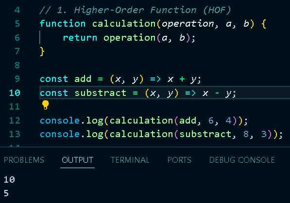
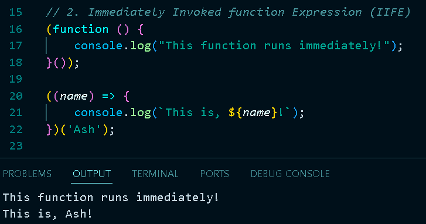
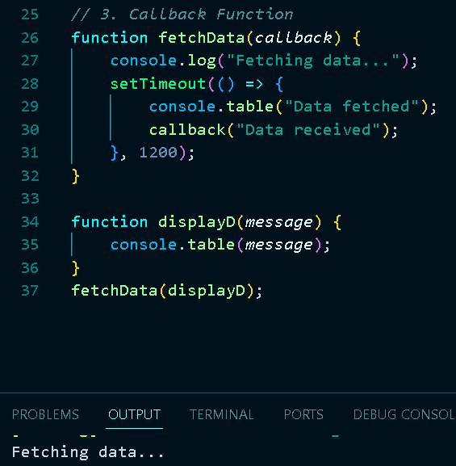
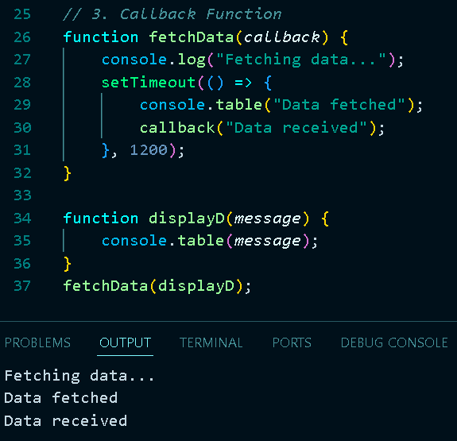
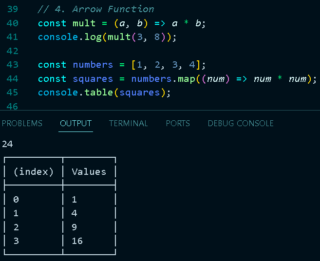
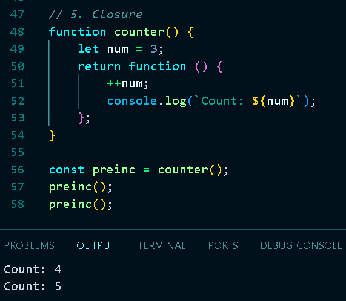
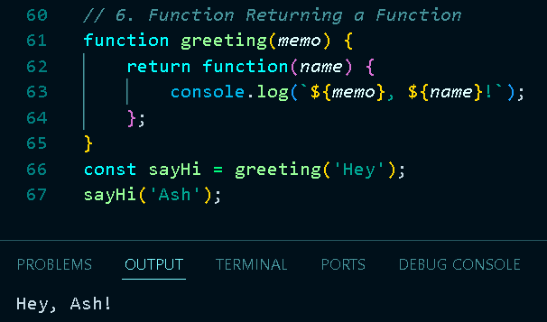
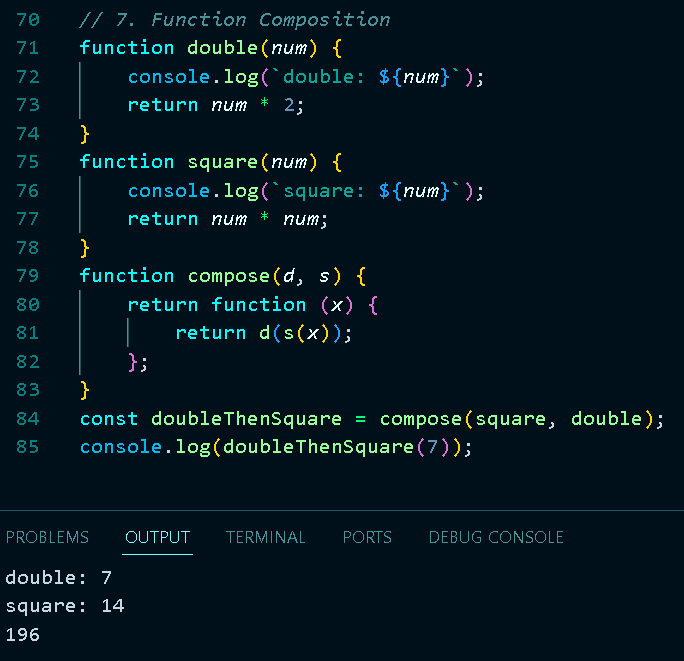
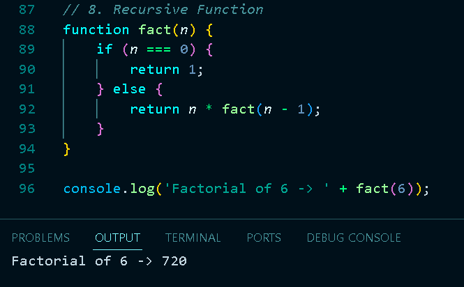

# JavaScript Challenge 30 - Day 10: Function Cardio 🧠

Welcome to **Day 10** of my **30 Days JavaScript Challenge**, where I explore the essentials of JavaScript functions. This project, titled **"Function Cardio"**, delves into various function concepts and techniques used in JavaScript, helping solidify my understanding of functional programming.

## Table of Contents
- [JavaScript Challenge 30 - Day 10: Function Cardio 🧠](#javascript-challenge-30---day-10-function-cardio-)
  - [Table of Contents](#table-of-contents)
  - [Overview](#overview)
  - [Concepts Covered](#concepts-covered)
  - [How to Run](#how-to-run)
- [Learnings \& Takeaways](#learnings--takeaways)
- [Repository](#repository)
- [Connect with Me](#connect-with-me)

## Overview
The **Function Cardio** project is a practical exercise aimed at understanding different function concepts in JavaScript. It includes:
- Higher-Order Functions (HOF)
  
  
- Immediately Invoked Function Expressions (IIFE)
  
  
- Callback Functions
  
  
  -
  
  
- Arrow Functions
  
  
- Closures
  
  
- Functions Returning Functions
  
  
- Function Composition
  
  
- Recursive Functions
  
  

This project is part of my continuous learning journey to enhance my skills as a developer by exploring the capabilities of JavaScript.

## Concepts Covered

1. **Higher-Order Function (HOF)**: Functions that take other functions as arguments or return them as results.
2. **Immediately Invoked Function Expression (IIFE)**: Functions that run immediately upon definition, used for isolated scopes.
3. **Callback Function**: Functions passed as arguments to be executed later, especially in asynchronous operations.
4. **Arrow Function**: A concise syntax for defining functions, often used for inline logic.
5. **Closure**: Functions that retain access to their lexical scope even when executed outside their original context.
6. **Function Returning a Function**: Functions that return other functions to create dynamic behavior.
7. **Function Composition**: Combining multiple functions for more complex operations.
8. **Recursive Function**: Functions that call themselves for repetitive tasks broken into smaller steps.

## How to Run

To run this project locally:
1. Clone the repository:
   ```bash
   git clone https://github.com/Ash-dot-coder/JavaScript_Challenge30.git
   ```

2. Navigate to the project folder:
    ```bash
    cd JavaScript_Challenge30/Day\ 10\ -\ [Function-Cardio]
    ```

3. Open the file in your code editor (e.g., VS Code) and run it using Node.js:
    ```bash
    node function-cardio.js
    ```

# Learnings & Takeaways
- Improved understanding of JavaScript's functional programming concepts.
- Practiced building modular and efficient code using arrow functions and closures.
- Gained experience in combining functions using HOFs and function composition for more complex logic.

# Repository
For the complete code and updates, check out the GitHub repository: https://github.com/Ash-dot-coder/JavaScript_Challenge30/tree/Js30/Day%2010%20-%20%5BFunction-Cardio%5D

# Connect with Me
I am on a 30 Days JavaScript Challenge, aiming to level up my JavaScript skills. Connect with me for more updates and code-related content:

LinkedIn: [Ayush Kohre](https://www.linkedin.com/in/aayush-kohre-dev1/)

Stay tuned for more updates as I continue this exciting journey! 🚀