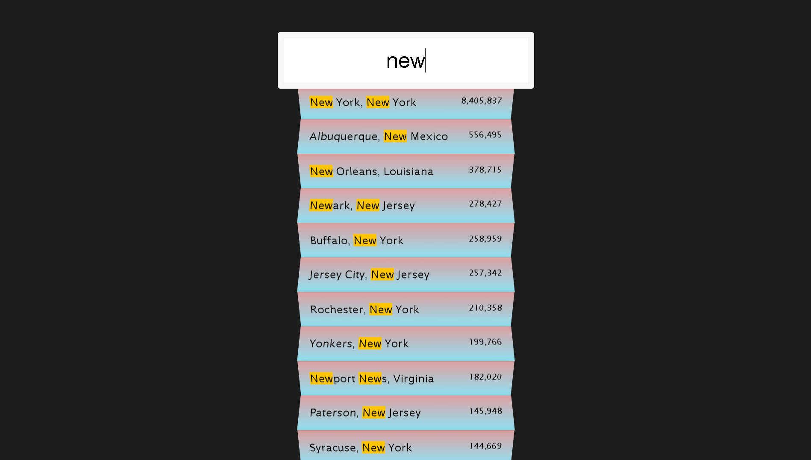

# Day 13: 30 Days JavaScript Challenge 🚀

Welcome to my **JavaScript Challenge 30** repository! This project is part of my journey to master JavaScript by completing 30 hands-on projects over 30 days. Each day focuses on building a unique JavaScript feature or application to improve my skills and knowledge in web development.

## 📚 Project Overview

This repository contains 30 different JavaScript projects. Each folder represents a day and showcases a specific challenge or task. The projects aim to enhance my understanding of core JavaScript concepts, including:

- DOM manipulation
- Event handling
- Fetch API usage
- CSS integration with JavaScript
- Interactive web components




These projects are designed to be small, interactive, and easy to understand for anyone learning JavaScript.

### 🔍 Day 13 - Type Ahead

Day 13 focuses on building a **Type Ahead** feature. This project allows users to search for cities or states in real-time, providing suggestions as they type. It demonstrates how to use the **Fetch API** to retrieve data, manipulate it, and display interactive results on the UI.

**Live Demo**: [Day 13 - Type Ahead](https://ash-dot-coder.github.io/JavaScript_Challenge30/Day%2013%20-%20%5BType-A-Head%7D/index.html)

### 💻 Code Details

1. **HTML**: 
   - Structured a search form with an input field and an unordered list (`<ul>`) to display the filtered suggestions.
   
2. **CSS**: 
   - Styled the search form, input field, and suggestions list to provide a clean and modern UI.
   - Applied gradient effects and box shadows to enhance the visual aesthetics of the suggestions list.

3. **JavaScript**:
   - Utilized the Fetch API to retrieve city and state data from an external endpoint.
   - Implemented functions for real-time search matching using regular expressions.
   - Dynamically updated the UI based on user input to create an interactive experience.

### 🚀 Main Repository

Explore all 30 projects in this challenge: [JavaScript Challenge 30 Repository](https://github.com/Ash-dot-coder/JavaScript_Challenge30).

### 📝 Project Setup

1. Clone the repository:
   ```bash
   git clone https://github.com/Ash-dot-coder/JavaScript_Challenge30.git
    ```

2. Navigate to Day 13:
    ```bash
    cd JavaScript_Challenge30/Js30/Day\ 13\ -\ [Type-A-Head]
    ```

3. Open the index.html file in your browser to view the project.

### 💡 Features to Explore
- Real-time search functionality with autocomplete.
- Dynamic DOM updates and styling using JavaScript.
- Using the Fetch API to retrieve JSON data from a URL.
- Interactive UI components styled with CSS.

### 🏗️ Project Structure
JavaScript_Challenge30/
│
├── Js30/
│   ├── Day 13 - [Type-A-Head]/
│   │   ├── index.html
│   │   ├── style.css
│   │   └── script.js
│   ├── Day 01 - ...
│   ├── Day 02 - ...
│   └── ... (other days' projects)

### 🤝 Acknowledgements
Special thanks to Wes Bos for his amazing JavaScript course, which inspired me to complete this 30-day challenge. His teaching methods and projects have significantly enhanced my JavaScript skills.[Wes Bos](https://wesbos.com/) 

🔗 Links
- Main Repository: [30-Projects](https://github.com/Ash-dot-coder/JavaScript_Challenge30)
- Current Project (Day 13): [Current-one](https://github.com/Ash-dot-coder/JavaScript_Challenge30/tree/Js30/Day%2013%20-%20%5BType-A-Head%7D)

📣 Follow My Progress
LinkedIn: [Ayush Kohre](https://www.linkedin.com/in/aayush-kohre-dev1/)
Github Id: [Ash-dot-coder](https://github.com/Ash-dot-coder)