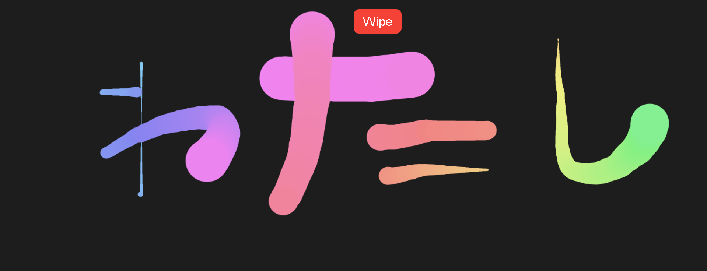

# Day 15: Doodle Wipe - JavaScript Challenge 30 🎨

## Overview 🌟  
**Doodle Wipe** is an interactive canvas tool created as part of my JavaScript challenge series. This project allows users to unleash their creativity by drawing vibrant doodles on a canvas and provides a simple way to erase everything with a single click. 

## Look 👁️



## Live Demo 🚀
You can view the live project: [View](https://ash-dot-coder.github.io/JavaScript_Challenge30/Day%2015%20-%20%5BDoodle-Wipe%5D/index.html)

## Features ✨
- **Dynamic Drawing**: Create colorful doodles with an adaptive canvas that works seamlessly on desktop and mobile devices.
- **Instant Wipe Functionality**: A dedicated button to clear the canvas instantly, allowing users to start fresh whenever they desire.
- **Responsive Design**: The canvas resizes according to the user's screen, ensuring an enjoyable experience across various devices.

## Technologies Used 💻
- **HTML5**: For structuring the web application.
- **CSS3**: For styling the canvas and buttons.
- **JavaScript**: For implementing dynamic drawing and erasing functionalities.

## Installation ⚙️
To run the project locally, follow these steps:

1. Clone the repository:
   ```bash
   git clone https://github.com/Ash-dot-coder/JavaScript_Challenge30.git
    ```

2. Navigate to the project directory:
    ```bash
    cd JavaScript_Challenge30/Day 15 - [Doodle-Wipe]
    ```

3. Open index.html in your web browser.


## Usage 🖌️
- Click and drag on the canvas to draw.
- Press the Wipe button to clear the canvas.

## Contribution 🤝
Feel free to fork the repository and make your own enhancements!
If you find any bugs or have suggestions, please open an issue.

## Acknowledgments 🙏
Special thanks to [Wes Bos](https://courses.wesbos.com/account/access/66fd24443e895f6dc6b58c53/view/194129962) for his excellent tutorials, which have significantly contributed to my learning and development skills.


## Repository Links 🔗
- Main Repository: [JavaScript Challenge 30](https://github.com/Ash-dot-coder/JavaScript_Challenge30)
- Current Project Repository: [Day 15 - Doodle Wipe](https://github.com/Ash-dot-coder/JavaScript_Challenge30/tree/Js30/Day%2015%20-%20%5BDoodle-Wipe%5D)


## Contact 
- Linkedin: [Ayush Kohre](https://www.linkedin.com/in/aayush-kohre-dev1/)
- Github Profite: [Ash-dot-coder](https://github.com/Ash-dot-coder)
