# Day 16: Console Tools - JavaScript Challenge 30 🧰

## Overview 📚

**Console Tools** is a project in my ongoing **JavaScript Challenge 30** series. This project explores the powerful debugging and logging features available in the browser console, showing how developers can effectively use these tools for inspecting data, tracking code performance, and interacting with the DOM.

## What It Looks Like 👀

This project operates entirely within the browser’s console, demonstrating the use of various console methods. To explore the features:

- Open your browser console (`Ctrl + Shift + J` or `Cmd + Option + J`).
- Interact with the elements on the page and observe how different console methods provide useful feedback and debugging information.

## Step-by-Step Project Summary 🔍

1. **Regular Console Log**:  
   Demonstrates the standard method for outputting messages in the console. It's useful for checking variable values and simple debugging.

   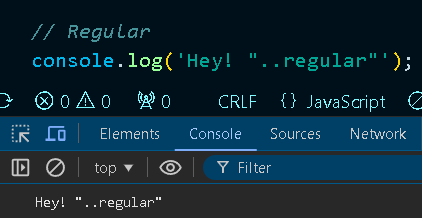

2. **Interpolated Console Log**:  
   Showcases how dynamic elements, such as variables or emojis, can be inserted into console messages. This is beneficial for creating more informative and engaging logs.

   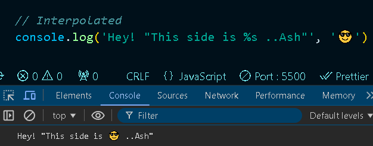

3. **Styled Console Log**:  
   Explains how to add CSS styles directly in console messages to emphasize important logs visually. This technique is effective for drawing attention to specific messages or warnings.

   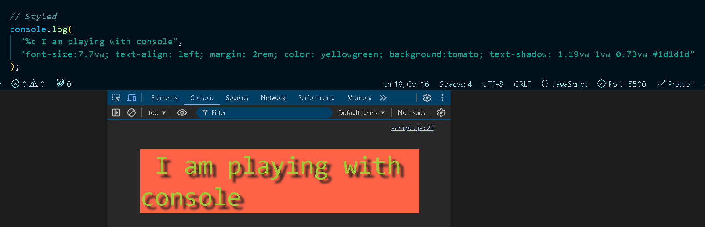

4. **Warning**:  
   Highlights how to log warning messages. This is typically used to indicate potential issues or points of concern within the code.

   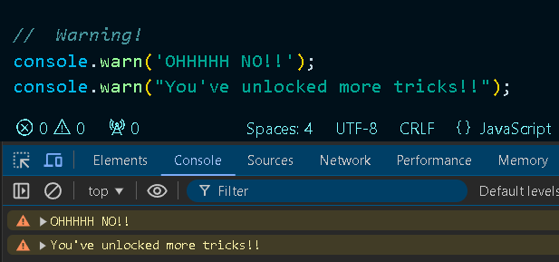

5. **Error**:  
   Demonstrates how to log errors with specific formatting. Error messages are important for debugging and understanding what went wrong in the code execution.

   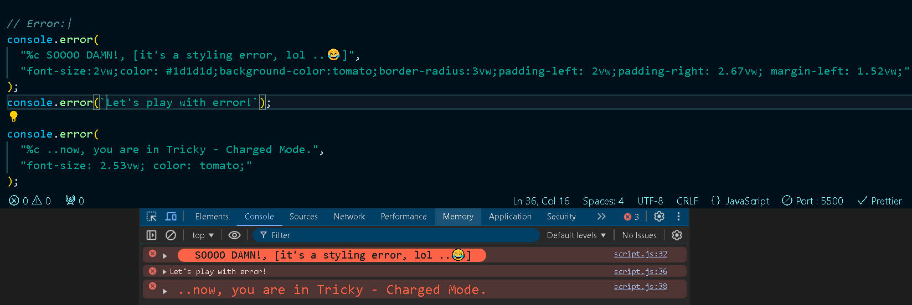

6. **Information**:  
   Provides a way to log additional context or information that might be helpful when understanding the flow of the code or the data being processed.

6.1 **Assertion Testing**:  
 Shows how to test conditions and log messages if those conditions are not met. This is useful for validating code logic and ensuring data integrity.

 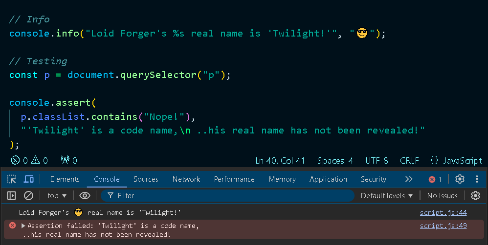

7. **Clearing the Console**:  
   Explains the importance of clearing the console to maintain a clean and organized environment for debugging, especially during complex code testing.

 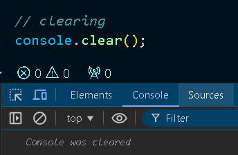  

8. **Viewing DOM Elements**:  
   Demonstrates how to log and inspect DOM elements directly in the console, providing a deeper understanding of their properties and behavior.

   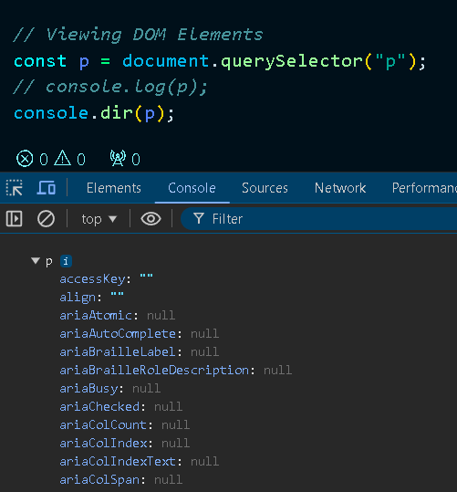  

9. **Grouping Console Messages**:  
   Illustrates how to organize related console messages into collapsible groups. Grouping logs makes it easier to manage and review related information during debugging.

   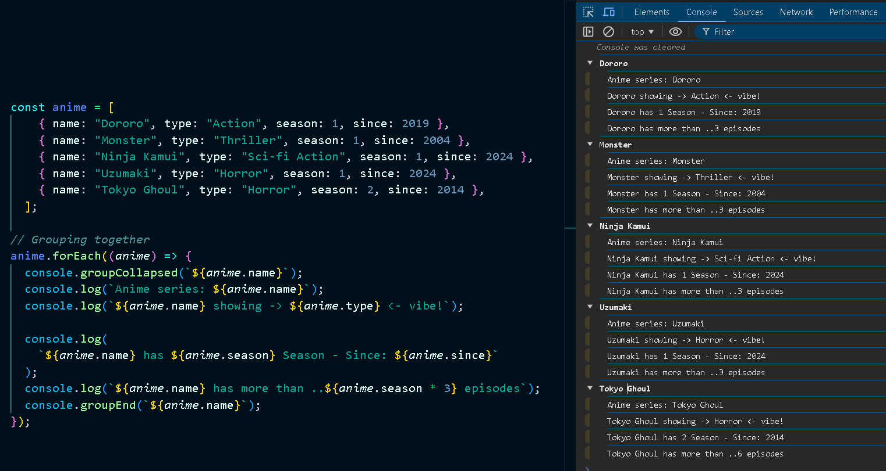  

10. **Timing API Fetch**:  
    Shows how to measure the time taken for an API call. This method helps in optimizing code performance by tracking how long various processes take.

    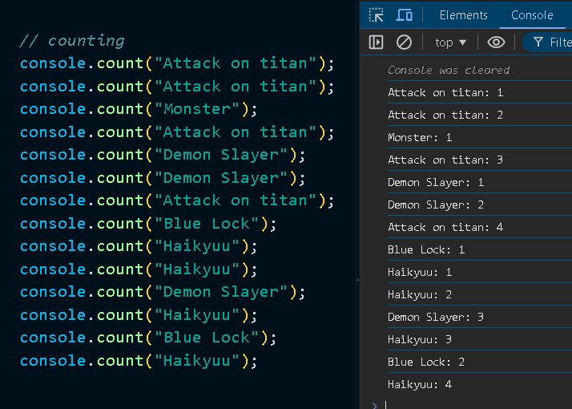  

11. **Counting Function Calls**:  
    Demonstrates how to keep track of the number of times a function has been called. This is useful for performance monitoring and debugging, helping developers understand the flow of their application and identify any unexpected behavior.

    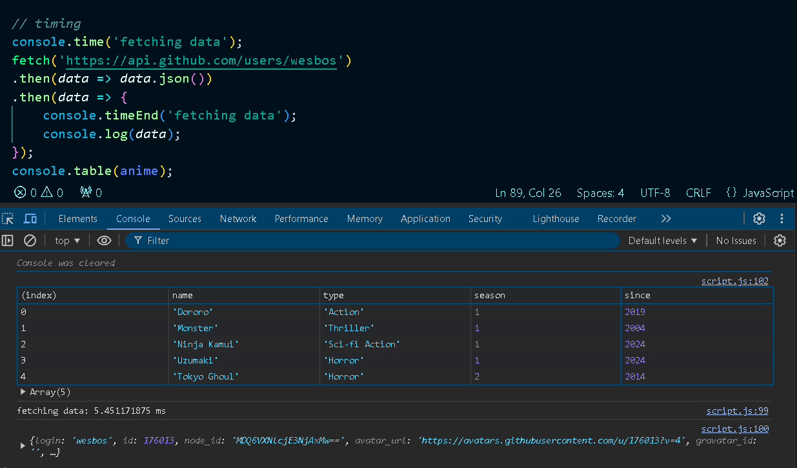  

## Features 🛠️

- **Dynamic Console Styling**: Learn how to style console logs to enhance visual clarity and highlight key information.
- **Grouping and Collapsing Logs**: Organize related console messages for better readability and management.
- **DOM Interaction**: Understand how to inspect and interact with DOM elements directly from the console.
- **Custom Warnings and Errors**: Demonstrate how to use warnings, errors, and assertions effectively for debugging purposes.
- **API Fetch with Timing**: Measure and display the duration of API calls for performance tracking and optimization.
- **Data Visualization**: Use tables and counters in the console to present structured information clearly and effectively.

## Technologies Used 💻

- **HTML**: Provides the structure and interactive elements for demonstrating console features.
- **JavaScript**: Implements console methods and DOM manipulation, showcasing debugging techniques and API interactions.

## Installation & Setup 🏗️

To run this project locally:

1. Clone the repository:
   ```bash
   git clone https://github.com/ash-dot-coder/JavaScript_Challenge30.git
   ```

2. Navigate to the project folder:
    ```bash
    cd JavaScript_Challenge30/Day 16 - [Console-Tools]
    ```

3. Open index.html in your browser and open the console to explore the logging techniques.


## Usage Guide 🖥️
- Click on the text element (xBREAKxDOWNx) to see how the console interacts with DOM elements and logs information dynamically.
- Experiment with the console to see examples of warnings, errors, assertions, and data fetching.
- Use console grouping to explore how information is organized and displayed efficiently.

## Learning Points 📖
- Console Debugging: Learn how to use console methods for effective debugging and data inspection.
- Performance Analysis: Utilize the console to measure API fetch times and optimize code performance.
- DOM Manipulation: See how to interact with and log DOM elements using various console methods.
- Data Presentation: Practice displaying structured data using tables and counters for clarity.

## Contribution 🤝
This is an open-source project, and contributions are always welcome. If you find any bugs or want to suggest improvements, please feel free to fork the repository and submit a pull request.

## Acknowledgments 🙏
A big thanks to [Wes Bos](https://courses.wesbos.com/account/signin) for his valuable tutorials, which have helped enhance my JavaScript and console debugging skills.

## Repository Links 🔗
- Js30 Repository: [JavaScript Challenge 30](https://github.com/Ash-dot-coder/JavaScript_Challenge30)
- Current Project Repository: Day 16 - [Console Tools](https://github.com/Ash-dot-coder/JavaScript_Challenge30/tree/Js30/Day%2016%20-%20%5BConsole-Tools%5D)

## Contact 💬
- LinkedIn: [Ayush Kohre](https://www.linkedin.com/in/aayush-kohre-dev1/)
- GitHub: [Ash-dot-coder](https://github.com/Ash-dot-coder)