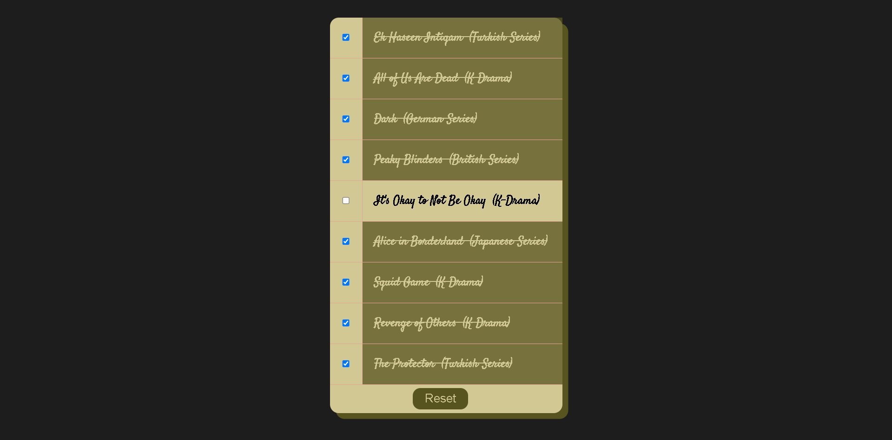

# 📅 Day 17 | Shift-Select Checkbox with Reset 🔄

Welcome to Day 17 of my 30 Days JavaScript Challenge! This project demonstrates a JavaScript implementation of a shift-select checkbox feature where you can select multiple checkboxes at once by holding down the Shift key and clicking, along with a reset button to clear all selections.

## 🚀 Project Summary
The Shift-Select Checkbox with Reset project showcases the following features:

- Shift-Select Functionality: Hold down the Shift key and click on a checkbox to select a range of checkboxes between the previously checked one and the current one.
- Reset Button: A reset button that allows you to clear all the selected checkboxes, returning everything to its default state.
- Custom Styling: The design uses custom fonts, colors, and transitions to create a smooth, visually appealing user experience.

## 🛠️ Technologies Used
- HTML: For structuring the webpage.
- CSS: To style the project with custom fonts, background colors, and transitions.
- JavaScript: Implements the functionality for shift-selecting checkboxes and resetting them using event listeners.

## 📂 File Structure
/Day 17 - [Hold-Shift-Multiple-CheckBox]

│

├── index.html
**The main HTML file with the checkbox list and reset button.**
├── style.css
**The CSS file containing custom styles for the inbox, items, and button.**
└── script.js
**JavaScript logic for handling checkbox selection and reset functionality.**


## ✨ Features
- Interactive Checkboxes: Select multiple checkboxes at once using the Shift key.
- Reset Button: Quickly unselect all checkboxes with a single click of the reset button.
- CSS Styling:
 - Smooth hover effects and transitions for the reset button.
 - Stylish font from Google Fonts to enhance the aesthetic.
 - Custom background and text colors for a polished appearance.

## 📋 How to Use
1. Clone the repository using:
    ```bash
    git clone https://github.com/Ash-dot-coder/JavaScript_Challenge30.git
    ```

2. Navigate to the Day 17 directory:
    ```bash
    cd JavaScript_Challenge30/Day 17 - [Hold-Shift-Multiple-CheckBox]
    ```

3. Open the index.html file in your browser.
4. Click on any checkbox to select it. Hold down the Shift key and click on another checkbox to select all checkboxes between the two.
5. Click the Reset button to clear all selected checkboxes.


## 🌐 Live Preview
[Live-Hosted-Site](https://ash-dot-coder.github.io/JavaScript_Challenge30/Day%2017%20-%20%5BHold-Shift-Multiple-CheckBox%5D/index.html)


## 📸 Project Preview





## 📚 Lessons Learned
In this project, I gained experience in:
 - Manipulating DOM elements using JavaScript to create dynamic interactions.
 - Handling event listeners efficiently, such as capturing shift key events and button clicks.
 - Creating fluid and interactive UI elements using CSS transitions and hover effects.


## 🔧 Future Enhancements
- Add animations when the checkboxes are selected for a more interactive user experience.
- Improve the accessibility of the project by adding ARIA roles and labels for screen readers.
- Expand the project to support different themes or styles based on user preference.

## 💻 Technologies
- HTML5
- CSS3
- Vanilla JavaScript (ES6+)

## 🔗 Repositories
 -J**S30 Repository: [JavaScript_Challenge30](https://github.com/Ash-dot-coder/JavaScript_Challenge30)**
 -D**ay 17 Project Repository: Day 17 - [Hold-Shift-Multiple-CheckBox](https://github.com/Ash-dot-coder/**JavaScript_Challenge30/tree/Js30/Day%2017%20-%20%5BHold-Shift-Multiple-CheckBox%5D)


## 🧑‍💻 Author
### 👤 Ayush Kohre
- GitHub ID: [Ash-dot-coder](https://github.com/Ash-dot-coder)
- LinkedIn ID: [Ayush Kohre](https://www.linkedin.com/in/aayush-kohre-dev1/)

**Enjoy coding! 👨‍💻💫 Feel free to reach out if you have any questions or suggestions!**