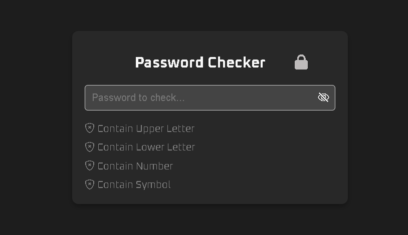
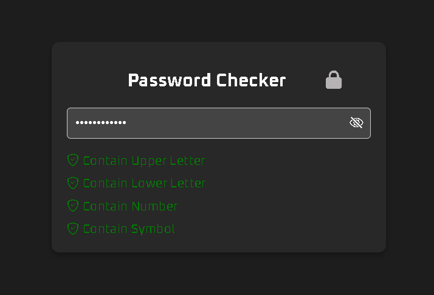
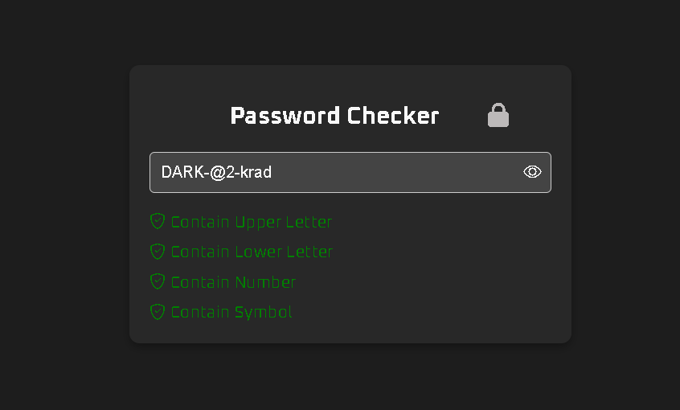

# 🔒 Day 18 - Password Checker

Welcome to **Day 18** of my **#30DaysOfJavaScript** Challenge! 🚀 In this project, I've created a **Password Checker** web page that validates user passwords based on multiple criteria using **HTML**, **CSS**, and **JavaScript**.

## 🌐 Live Demo
Check out the live version of the project here:  
[Password Checker Live Demo](https://ash-dot-coder.github.io/JavaScript_Challenge30/Day%2018%20-%20%5BPassword-Checker%5D/index.html)

## 📂 Project Repository
Explore the code for this project:  
[Day 18 - Password Checker Repository](https://github.com/Ash-dot-coder/JavaScript_Challenge30/tree/Js30/Day%2018%20-%20%5BPassword-Checker%5D)

## 📝 Project Overview

The **Password Checker** project is a web-based tool that allows users to test the strength of their passwords. It evaluates passwords based on the presence of:
- ✅ Uppercase letters
- ✅ Lowercase letters
- ✅ Numbers
- ✅ Special characters

### 📸 Project Interface






## 🔧 Features

- **Dynamic Password Validation**: The webpage validates the password as you type, checking for:
  - ✅ Uppercase letters
  - ✅ Lowercase letters
  - ✅ Numbers
  - ✅ Special characters
- **Toggle Password Visibility**: An eye icon 👁️ allows users to toggle between showing and hiding the password.
- **Real-time Feedback**: Icons and text update instantly to indicate which password criteria are met.
- **Interactive Animation**: A subtle animation effect is applied to enhance the user experience.

## 🛠️ Tech Stack

- **HTML**: Markup structure for the webpage.
- **CSS**: Styling for the layout, input field, and validation states.
- **JavaScript**: Logic for password validation and interactivity.

## 📖 How It Works

1. **Input Field**: The user enters a password in the input field.
2. **Validation Rules**: JavaScript checks for:
   - At least one uppercase letter
   - At least one lowercase letter
   - At least one number
   - At least one special character
3. **Real-time Updates**: The page updates icons and validation messages dynamically as the user types.
4. **Password Toggle**: Users can click on the eye icon to toggle visibility.

## 🚀 How to Run Locally

To run the project locally on your machine:

1. Clone the repository:
   ```bash
   git clone https://github.com/Ash-dot-coder/JavaScript_Challenge30.git
   ```

2. Navigate to the project directory:
    ```bash
    cd JavaScript_Challenge30/Day 18 - [Password-Checker]
    ```

3. Open the index.html file in your browser.

## 💡 Lessons Learned
- Implementing regular expressions for password validation.
- Enhancing user experience through real-time feedback and interactive animations.
- Working with toggle features using JavaScript to improve functionality and user control.

## 📅 The #30DaysOfJavaScript Journey
This project is part of my 30-day challenge to build small but functional web projects using JavaScript. You can view the entire repository for all my daily projects here:
[JavaScript Challenge 30 - Full Repository](https://github.com/Ash-dot-coder/JavaScript_Challenge30)

## 🌟 What's Next?
I will continue building more exciting projects as part of this challenge! Stay tuned for more updates and improvements. 💪

## 🙌 Connect with Me
If you liked this project or have any suggestions, feel free to connect with me:
- GitHub: [Ash-dot-coder](https://github.com/Ash-dot-coder)
- LinkedIn: [Ayush Kohre](https://www.linkedin.com/in/aayush-kohre-dev1/)