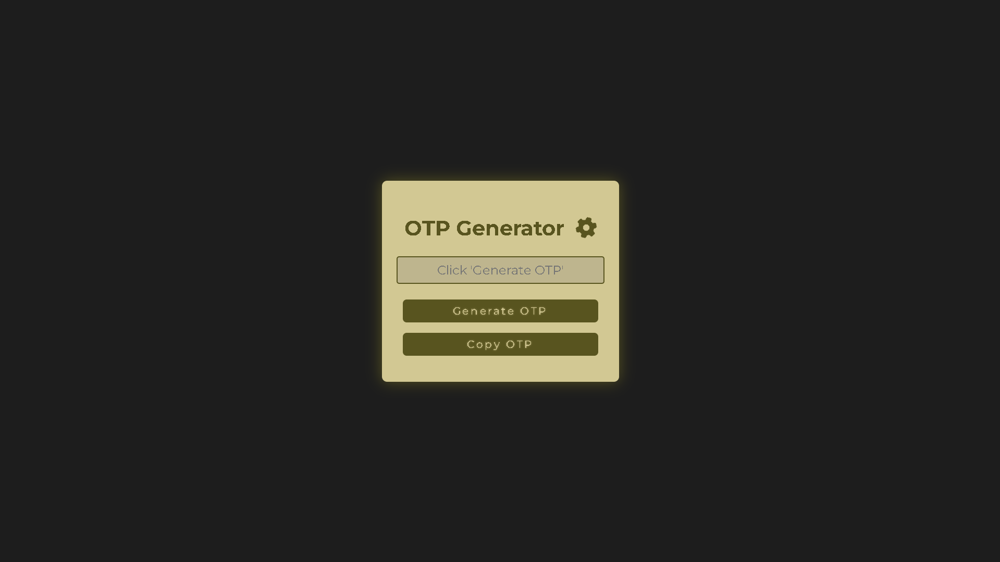
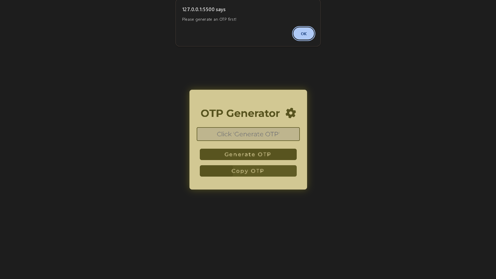
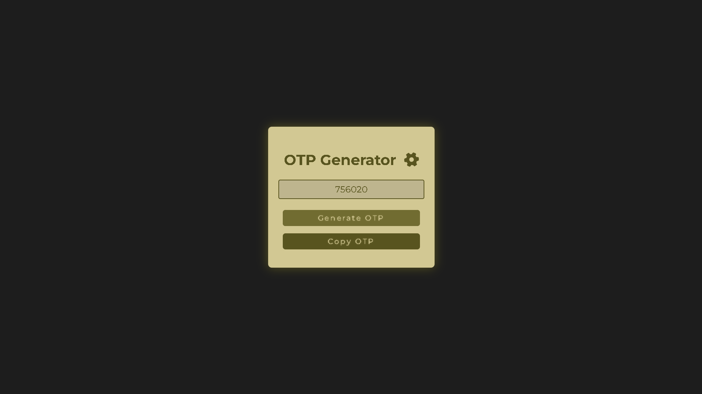
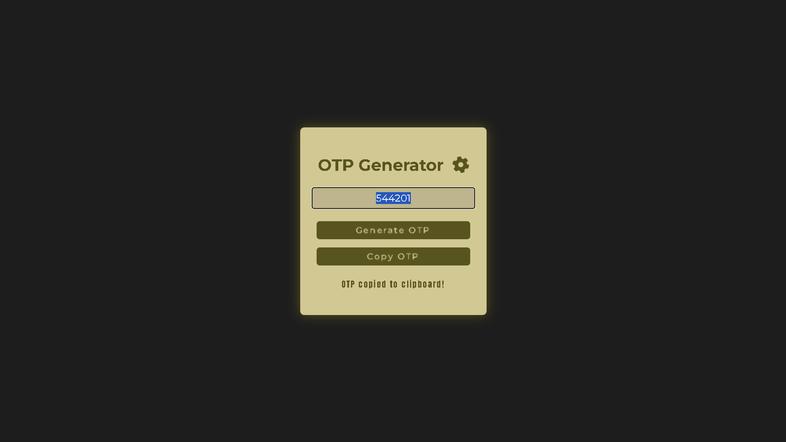

# 📌 Day 19 - OTP Generator [JavaScript Challenge]

Welcome to Day 19 of my **30-Day JavaScript Challenge**! 🎉 In this project, I created an **OTP Generator** with an interactive and responsive user interface using **HTML**, **CSS**, and **JavaScript**. This project highlights the power of combining these technologies to create dynamic, user-friendly web applications. 🚀

## 🔗 Project Links
- **Live Demo**: [OTP Generator - Live Preview](https://ash-dot-coder.github.io/JavaScript_Challenge30/Day%2019%20-%20%5BOTP-Generated%5D/index.html)  
- **JavaScript Challenge Repository**: [JavaScript_Challenge30](https://github.com/Ash-dot-coder/JavaScript_Challenge30)  
- **Day 19 Project Repo**: [Day 19 - OTP Generator Repository](https://github.com/Ash-dot-coder/JavaScript_Challenge30/tree/Js30/Day%2019%20-%20%5BOTP-Generated%5D)

## 📝 Project Overview

The **OTP Generator** is a simple and functional web application that generates a 6-digit OTP (One-Time Password) every time you click the 'Generate OTP' button. Additionally, it includes a 'Copy OTP' button, which allows users to quickly copy the generated OTP to the clipboard with a confirmation message indicating success.

### 🖼️ **Look**

  
  
  
  

## ✨ Features

1. **Dynamic OTP Generation**:  
   The application generates a unique 6-digit OTP each time the 'Generate OTP' button is pressed, ensuring randomness and security.

2. **Copy to Clipboard**:  
   The 'Copy OTP' button lets users copy the OTP directly to their clipboard with a single click. An animated success message confirms when the OTP has been successfully copied.

3. **Interactive & Modern UI**:  
   - Frosted glass effect for the container and smooth hover animations for the buttons.
   - A rotating gear icon animation at the top adds visual interest and enhances the overall user experience.
   - Fully responsive design, making it accessible on both desktop and mobile devices.

## 🧰 Technologies Used

- **HTML** - for the structure and layout of the application.
- **CSS** - for the styling, animations, and creating a modern, interactive user interface.
- **JavaScript** - for generating the OTP, handling button interactions, and clipboard operations.

## 🎯 How It Works

- **Generate OTP**: Click the button to generate a new 6-digit OTP that will be displayed in the input field.
- **Copy OTP**: After generating an OTP, click the 'Copy OTP' button to copy the value to your clipboard. A success message will appear briefly, indicating the OTP was copied successfully.

## 🛠️ Getting Started

To run the project locally:

1. **Clone the Repository**:
   ```bash
   git clone https://github.com/Ash-dot-coder/JavaScript_Challenge30.git
    ```

2. Navigate to the Project Directory:
    ```bash
    cd JavaScript_Challenge30/Day\ 19\ -\ [OTP-Generated]
    ```

3. Open the index.html File in Your Browser.

## 📦 Project Structure
    JavaScript_Challenge30/
    │
    ├── Day 19 - [OTP-Generated]/
    │   ├── images/
    │   │   ├── copy-withoutOTP
    │   │   ├── interface
    │   │   ├── otpCopied
    │   │   └── otpGenerated
    │   ├── index.html 
    │   ├── style.css  
    │   └── script.js  
    │
    ├── README.md
    └── ...

## 💻 What I Learned
This project taught me a lot about creating user-friendly, interactive web applications using front-end technologies. Key learnings include:

- Building responsive layouts with CSS and using media queries for cross-device compatibility.
- Implementing animations (e.g., button hover effects and icon rotation) to enhance user engagement.
- Using JavaScript to manipulate the DOM and interact with user input dynamically.
- Clipboard operations in JavaScript for improved functionality and user experience.

## 🌱 Future Enhancements
I'm planning to add the following features in the future:
- Dark/Light Mode toggle for improved accessibility and user preference.
- Customizable OTP Length: Allow users to select the length of the OTP (4, 6, or 8 digits).
- OTP Expiry Countdown: Add a timer indicating how long the OTP is valid.

## 📬 Feedback and Contributions
I'm open to suggestions and would love to receive feedback on how I can improve or enhance this project. Feel free to:

- Create an issue on the project repository.
- Submit a pull request if you'd like to contribute directly!

## 🔗 Let’s Connect:
- GitHub: [Ash-dot-coder](https://github.com/Ash-dot-coder)
- LinkedIn: [Ayush Kohre](https://www.linkedin.com/in/aayush-kohre-dev1/)
