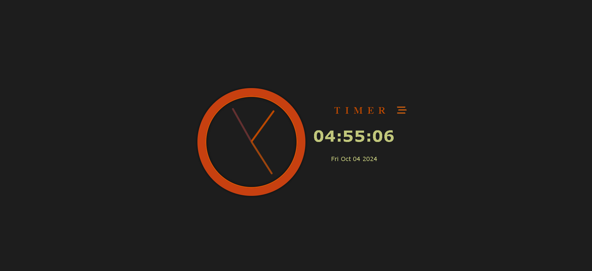

# JavaScript Challenge 30 🚀

Welcome to my **JavaScript Challenge 30**, where I am enhancing my JavaScript skills through various projects over 30 days. Each day focuses on a different project, showcasing different functionalities and learning outcomes.

## Day 2: Clock Project (Analog and Digital) ⏰

This project features both analog and digital clocks, designed to show real-time updates of the current time.

### 🖥️ Project Preview

  
*(The above image shows the layout of both the analog and digital clocks.)*

### 🎯 Key Features

- **Analog Clock**: A beautifully rendered analog clock with moving hour, minute, and second hands.
- **Digital Clock**: Displays the current time in a digital format, updating every second.
- **Real-time Updates**: Both clocks update in real-time, providing accurate time.
- **User-Friendly Interface**: Designed with a clean and simple UI for easy readability.

### 🛠️ Technologies Used

- **HTML**: Structure and layout of the webpage.
- **CSS**: Styling for the clocks and overall design.
- **JavaScript**: Used to handle the time logic and updates for both clock types.

### 🎬 Demo

Check out the live demo of the Clock Project [..Click me](https://ash-dot-coder.github.io/JavaScript_Challenge30/Day%202%20-%20%5BClock%5D/index.html).
Experience the beauty of timekeeping with this interactive project!

### 📁 Folder Structure

The project repository contains two folders:
JavaScript_Challenge30/

│ 
├── /Day 2 - [Clock]
├── index.html
├── styles.css
├── script.js


### 📂 How to Run Locally

To run this project locally, follow these steps:

1. **Clone the repository**:
    ```bash
    git clone https://github.com/Ash-dot-coder/JavaScript_Challenge30.git
    ```
2. **Navigate to the Clock project folder**:
    ```bash
    cd JavaScript_Challenge30/Clock
    ```
3. **Open the `index.html` file** in your preferred browser to see both the analog and digital clocks in action.

### 🚀 Future Enhancements

- **Custom Themes**: Allow users to choose different styles and themes for the clocks.
- **Alarm Functionality**: Implement an alarm feature to set specific times for alerts.
- **Timezone Support**: Enable the display of multiple time zones.

### 🙏 Acknowledgments

- Special thanks to **Wes Bos** for providing excellent tools and resources that inspired this project.

### 🔗 Connect with Me

- GitHub: [ash-dot-coder](https://github.com/Ash-dot-coder)
- LinkedIn: [Ayush Kohre](https://www.linkedin.com/in/aayush-kohre-dev1/)

---

Feel free to try it out, contribute, or leave feedback!
