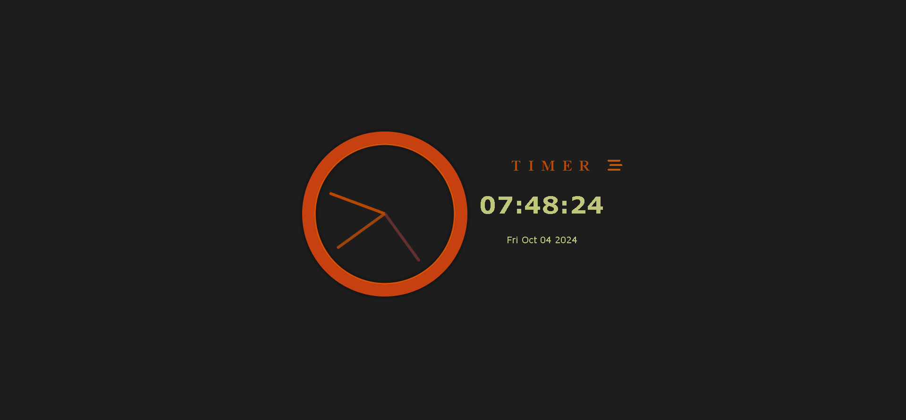

# Clock Project (Analog and Digital) ⏰

Welcome to the **Clock Project**, where you can experience both analog and digital time displays in a single interface. This project showcases how to implement real-time clocks using HTML, CSS, and JavaScript.

## 🖥️ Project Preview

  
(The above image shows the layout of both the analog and digital clocks.)

## 🎯 Key Features

- **Analog Clock**: A beautifully rendered analog clock with moving hour, minute, and second hands.
- **Digital Clock**: Displays the current time in a digital format, updating every second.
- **Real-time Updates**: Both clocks update in real-time, providing accurate time.
- **User-Friendly Interface**: Designed with a clean and simple UI for easy readability.

## 🛠️ Technologies Used

- **HTML**: Structure and layout of the webpage.
- **CSS**: Styling for the clocks and overall design.
- **JavaScript**: Used to handle the time logic and updates for both clock types.

## 🎬 Demo

Check out the live demo of the Clock Project [here](#).  
Experience the beauty of timekeeping with this interactive project!

## 📁 How to Run Locally

To run this project locally, follow these steps:

1. **Clone the repository**:
    ```bash
    git clone https://github.com/ash-dot-coder/clock-project.git
    ```
2. **Navigate to the project folder**:
    ```bash
    cd clock-project
    ```
3. **Open the `index.html` file** in your preferred browser to see both the analog and digital clocks in action.

## 📂 Folder Structure

