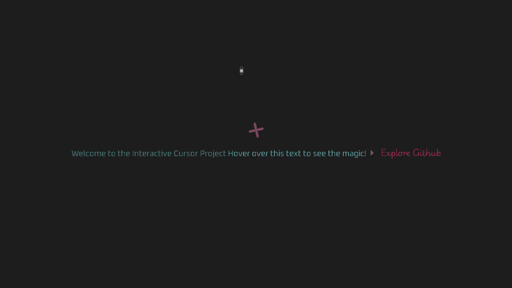
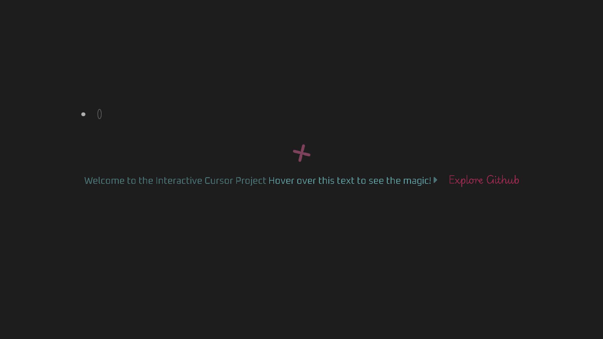
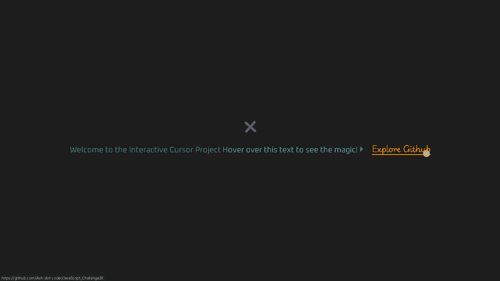
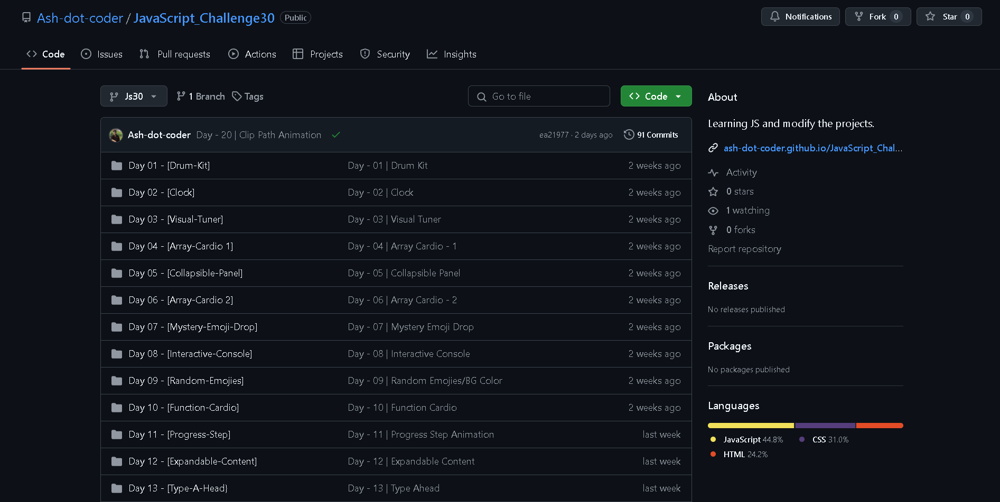

# 🎯 **Day 21: Enhanced Custom Cursor Project** 🖱️

Welcome to Day 21 of my 30-day JavaScript Challenge! This project focuses on creating an interactive and visually appealing custom cursor experience using HTML, CSS, and JavaScript.

## 🌟 **Project Overview**

This project features a unique custom cursor with two elements—a smaller inner cursor and a larger outer cursor—that dynamically follow your mouse movements. Hovering over specific elements triggers animations and style changes, enhancing the overall user experience.

**Key Features**:
- 🚀 **Dynamic Custom Cursor** that tracks mouse movement.
- ✨ **Interactive Hover Animations** that adjust cursor styles and colors.
- 🎨 **Smooth Transitions** for a seamless user experience.
- 🔗 **Interactive Links** with hover effects for enhanced engagement.
- ⚙️ **Responsive Design** that adapts to all screen sizes.


## 📜 **Tech Stack**

The project utilizes the following technologies:
- **HTML** 📝 for structuring the content.
- **CSS** 🎨 for styling and animations.
- **JavaScript** ⚙️ for custom cursor behavior and interactions.

## 📂 **Project Structure**

```
📦 Enhanced Custom Cursor
 ┣ 📜 index.html          # HTML structure
 ┣ 📜 style.css           # CSS styling and animations
 ┗ 📜 script.js           # JavaScript functionality
```

## 🎨 Project Demo
[Live Hosted](https://ash-dot-coder.github.io/JavaScript_Challenge30/Day%2021%20-%20%5BCustom%20Cursor%5D/index.html)

## 🖼️ Preview






### 📄 Project Repositories
- 📂 Current Project Repository: [Day 21 - Custom Cursor](https://github.com/Ash-dot-coder/JavaScript_Challenge30/tree/Js30/Day%2021%20-%20%5BCustom%20Cursor%5D)
- 📜 Full JS30 Project Repository: [JavaScript Challenge 30](https://github.com/Ash-dot-coder/JavaScript_Challenge30) - Explore all my JavaScript projects!


## 📝 **How to Use**

1. **Clone the repository**:
   ```bash
   git clone https://github.com/Ash-dot-coder/JavaScript_Challenge30.git
   ```
2. **Navigate to the project directory**:
   ```bash
   cd Enhanced_Custom_Cursor
   ```
3. **Open `index.html`** in your browser to see the custom cursor in action!

## 💡 **Features in Detail**

### 🖥️ **Custom Cursor**
- The cursor has two elements:
  - **Inner Cursor**: Changes size and style when hovering over interactive elements.
  - **Outer Cursor**: Smoothly follows the mouse, enhancing visual feedback.

### 🎯 **Hover Animations**
- The cursor reacts when hovering over headers, links, and buttons, changing shape and color for better user engagement.


## 📚 **Learning Outcomes**

- Gained insights into handling mouse events in JavaScript.
- Improved skills in creating **smooth CSS animations**.
- Enhanced understanding of DOM manipulation for interactive experiences.

## 📌 **Project Challenges**

- Ensuring smooth cursor movement without lag.
- Achieving responsive and consistent behavior across various devices.

## 📢 **Feedback & Contributions**

Feel free to open an issue if you encounter bugs or have feature suggestions. Contributions are always welcome!


## 🌐 Connect with Me
- GitHub: [ash-dot-coder](https://github.com/Ash-dot-coder)
- LinkedIn: [Ayush Kohre](https://www.linkedin.com/in/aayush-kohre-dev1/)


## 📅 **Day 21 Progress Log**

| Day | Challenge   | Status       |
|-----|-------------|--------------|
| 21  | Enhanced Custom Cursor | ✅ Completed |

---

Let me know if you need any further customization or additional details! 😊