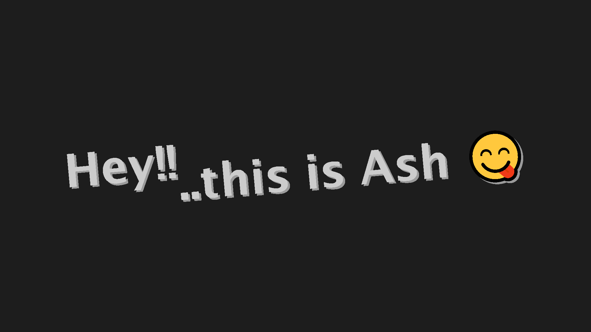
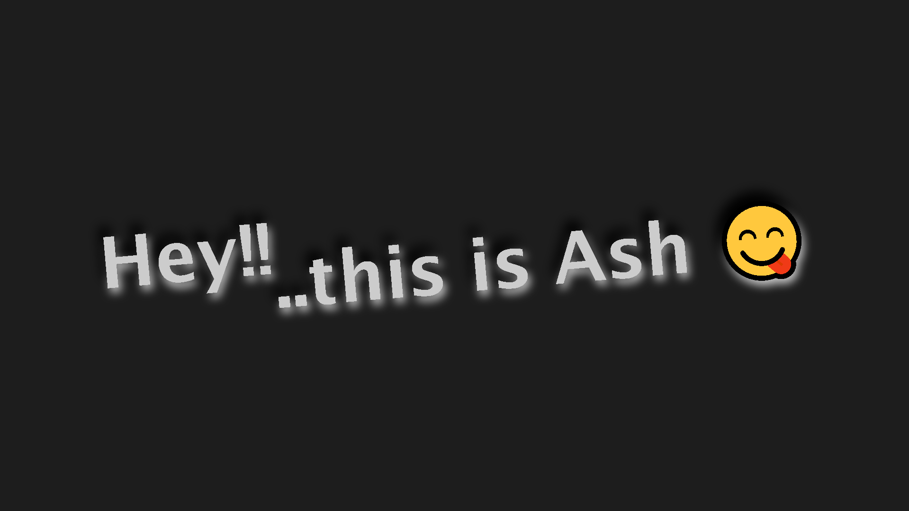
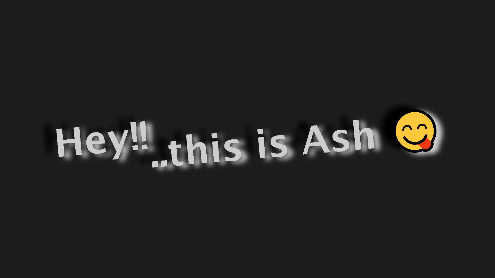

# 📅 Day 23 - Mouse Moving Shadow! 🌟

## 📂 Repository Links
- **JS30 Repository**: [📘 JavaScript Challenge 30](https://github.com/Ash-dot-coder/JavaScript_Challenge30)
- **Current Project**: [Day 23 - Mouse Moving Shadow](https://github.com/Ash-dot-coder/JavaScript_Challenge30/tree/Js30/Day%2023%20-%20%5BMouse-Moving-Shadow%5D)

## 📝 Project Overview

**Project Title**: Mouse Moving Shadow 🎨  
This project is a part of my 30 Days JavaScript Challenge. The goal was to create a cool, interactive visual effect using JavaScript, HTML, and CSS, where the shadow of the text moves in response to mouse movements, creating a dynamic user experience.

## ✨ Key Features

- **🖱️ Interactive Shadow Effect**: As you move the mouse around the screen, the text shadow shifts to follow the cursor, creating a lively visual effect.
- **🎨 Simple and Clean UI**: A minimalistic, dark background with editable text for a modern and focused look.
- **📝 Editable Text**: The content of the `<h1>` tags is editable, allowing users to modify the displayed text.
- **📊 Minimal Animation**: Subtle yet effective movement of the text-shadow for an engaging experience.

## 📸 Screenshot

## 📚 Technologies Used

- **🏷️ HTML5**: For structuring the content and adding editable text areas.
- **🎨 CSS3**: For basic styling and setting up the initial text-shadow.
- **📜 JavaScript**: For creating the dynamic shadow effect based on mouse movement.

## ⚙️ How It Works

The project captures mouse movements within the `.hero` container and calculates the shadow's position based on the cursor's coordinates. Here's a breakdown of the process:

1. **Mouse Tracking**: JavaScript captures the mouse's `offsetX` and `offsetY` as it moves within the `.hero` container.
2. **Dynamic Shadow**: The script calculates the shadow's direction and distance using the defined `walk` value to determine the intensity and position of the shadow.
3. **Editable Text**: The two `<h1>` elements are set to `contenteditable`, allowing users to directly modify the displayed text.

## 🎯 Challenges & Learning

This project was an opportunity to:
- **Practice JavaScript Mouse Events** 🖱️, specifically `mousemove`, for dynamic updates.
- **Experiment with CSS `text-shadow`** ✏️, focusing on multi-layered shadow effects.
- **Learn About Editable HTML Elements** ✍️ by utilizing `contenteditable` attributes.

## 🌐 Live Demo

Experience the project live here: [🌍 Live Demo](https://ash-dot-coder.github.io/JavaScript_Challenge30/Day%2023%20-%20%5BMouse-Moving-Shadow%5D/index.html)

## 🤝 Let's Connect

For any questions, feedback, or collaboration, feel free to reach out! Let’s stay connected:

- **🐙 GitHub**: [ash-dot-coder](https://github.com/ash-dot-coder)
- **💼 LinkedIn**: [Ayush Kohre](https://www.linkedin.com/in/aayush-kohre-dev1/)

---

Feel free to check out the other projects in my **JavaScript_Challenge30** repository for more interesting challenges and JavaScript-based projects.
