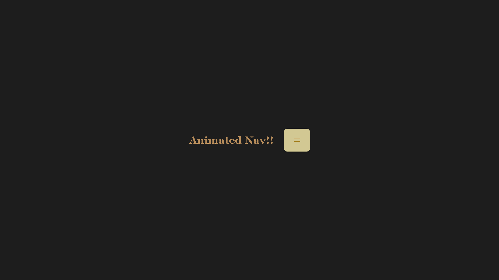
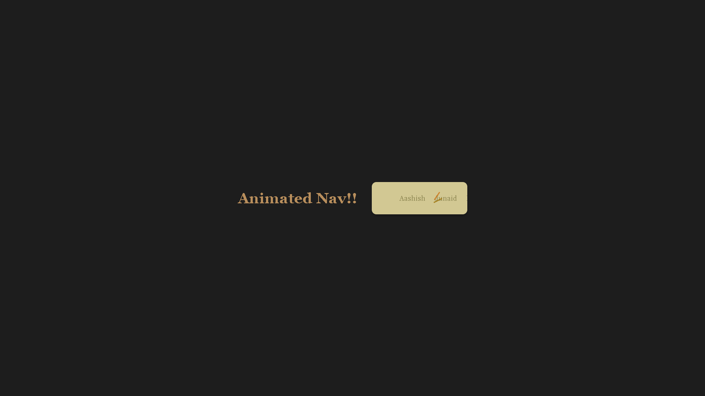
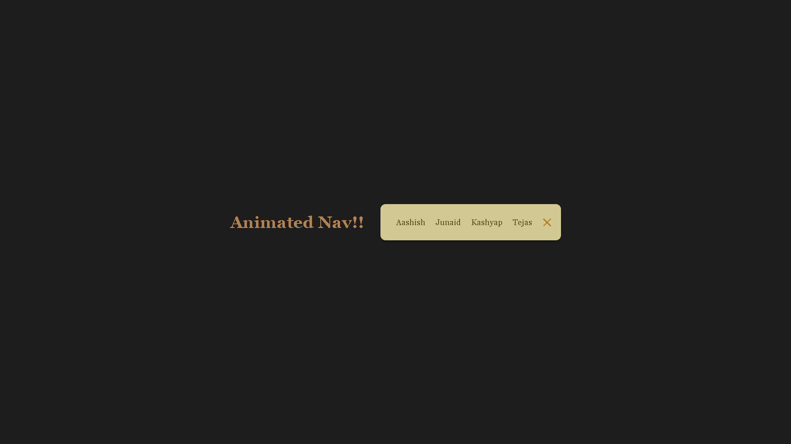
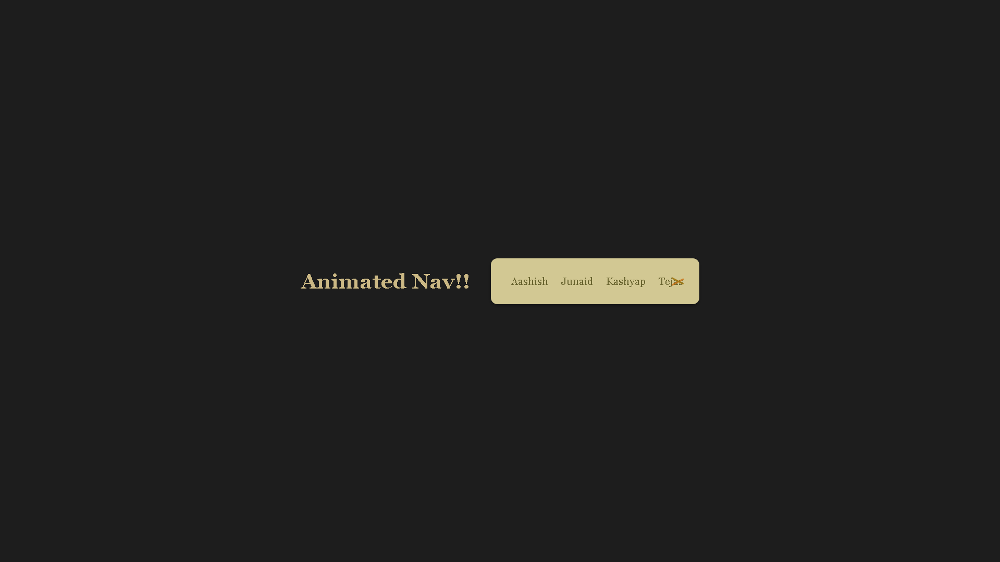

# 💻 Day 24 - Animated Navigation! 🎉

## 📂 Repository Links
- **JS30 Repository**: [📘 JavaScript Challenge 30](https://github.com/Ash-dot-coder/JavaScript_Challenge30)
- **Current Project**: [Day 24 - Animated Navigation](https://github.com/Ash-dot-coder/JavaScript_Challenge30/tree/Js30/Day%2024%20-%20%5BAnimated-Nav%5D)

## 📝 Project Overview

**Project Title**: ***Animated Navigation*** 🚀  
This project is part of my 30 Days JavaScript Challenge. Here, I created an interactive, expandable navigation bar that features smooth animations using JavaScript, HTML, and CSS to enhance user experience. 

## ✨ Key Features

- **📜 Toggleable Navigation Bar**: Expands and collapses when the toggle button is clicked, providing a sleek and modern menu experience.
- **🔄 Smooth Animations**: Rotating menu items and an animated toggle button for a responsive look.
- **🎨 Minimal Design**: A clean design with a background color contrast for focus and usability.
- **💻 Responsive Layout**: Ensures the nav bar is accessible and visually appealing on any screen size.

## 📸 Visual Preview

## 📚 Technologies Used

- **🏷️ HTML5**: For structuring the navigation bar and interactive button.
- **🎨 CSS3**: For animations (keyframes, transitions) and responsive styling.
- **📜 JavaScript**: For class toggling and dynamic interactivity with the DOM.

## ⚙️ How It Works

This project uses JavaScript to control the expansion and animation of the navigation bar:
  
1. **Class Toggle**: A `click` event listener is set on the toggle button to add or remove an `active` class on the `nav` element.
2. **CSS Transitions**: When active, the nav expands and displays the menu items with rotation and fade-in effects.
3. **Animated Button**: The toggle button lines rotate to form an "X" when the nav is expanded, adding a visual cue.

## 🎯 Challenges & Learning

Through this project, I:
- Practiced **JavaScript DOM Manipulation** ✨ for adding and removing classes dynamically.
- Explored **CSS Transformations and Transitions** 🌀 for smooth animations.
- Improved my understanding of **Responsive Design** 📱, ensuring the navigation bar adapts to various screen sizes.

## 🌐 Live Demo

Experience the project live here: [🌍 Live Demo](https://ash-dot-coder.github.io/JavaScript_Challenge30/Day%2024%20-%20%5BAnimated-Nav%5D/index.html)

## 🤝 Let's Connect

For any questions, feedback, or collaboration, feel free to reach out! Let’s stay connected:

- **🐙 GitHub**: [ash-dot-coder](https://github.com/ash-dot-coder)
- **💼 LinkedIn**: [Ayush Kohre](https://www.linkedin.com/in/aayush-kohre-dev1/)

---

Explore more of my **JavaScript_Challenge30** repository for additional creative projects and interactive experiences!