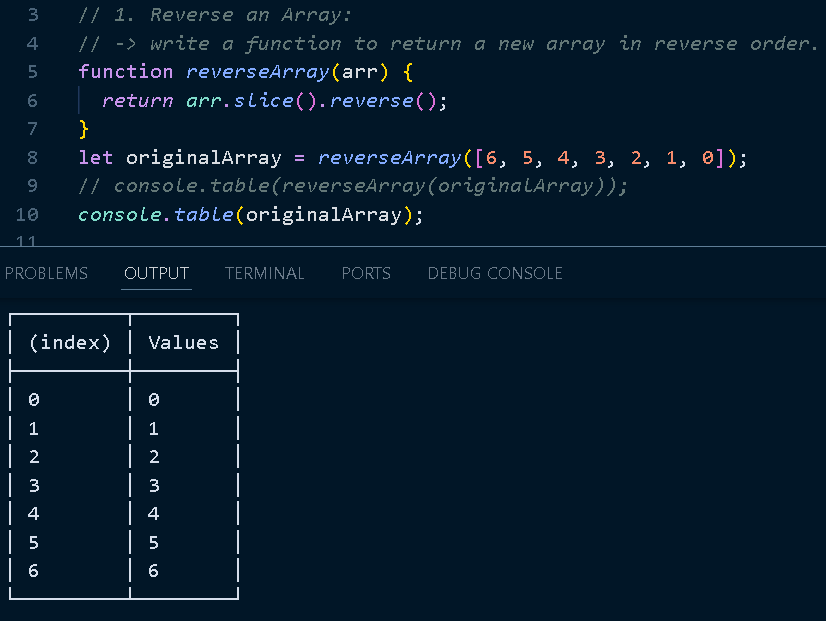
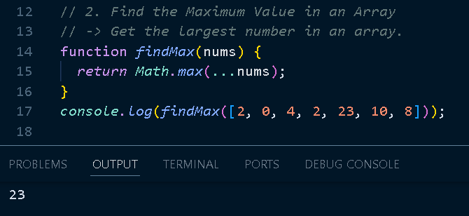
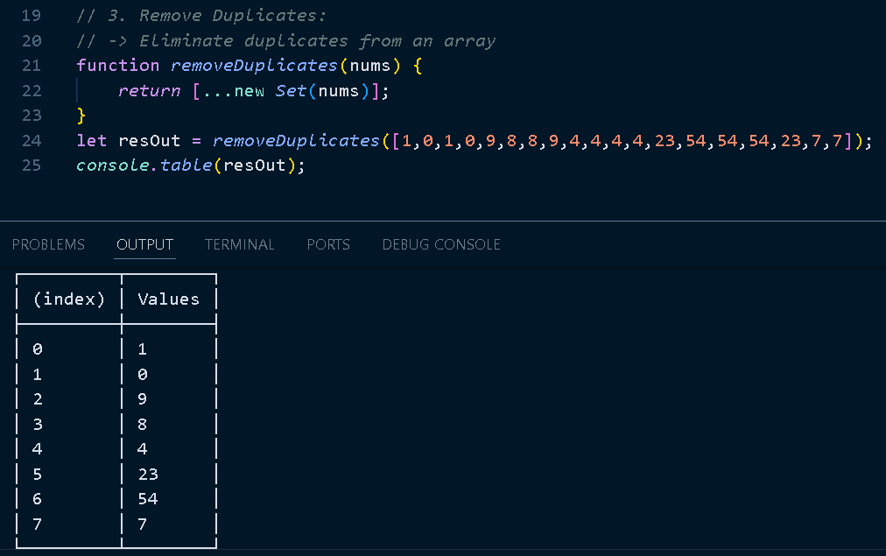
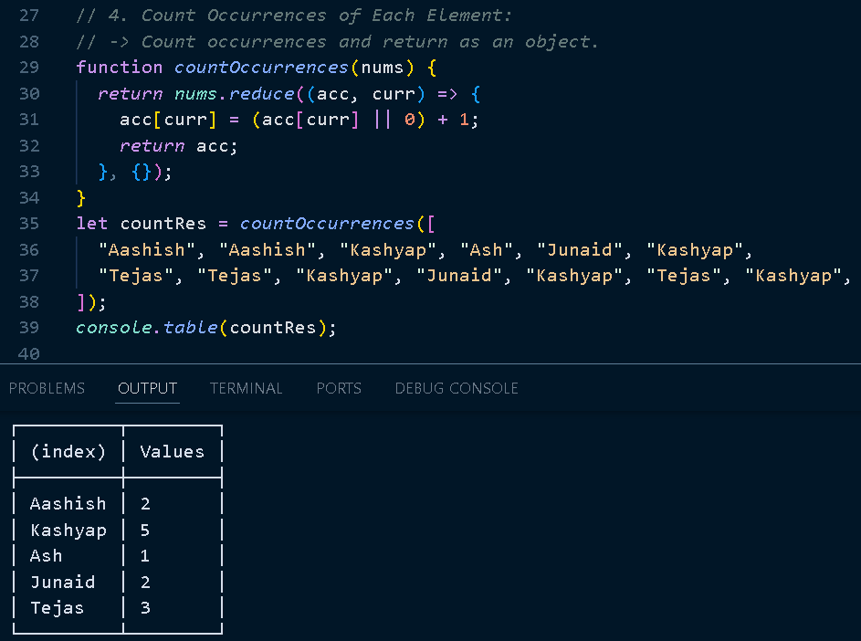
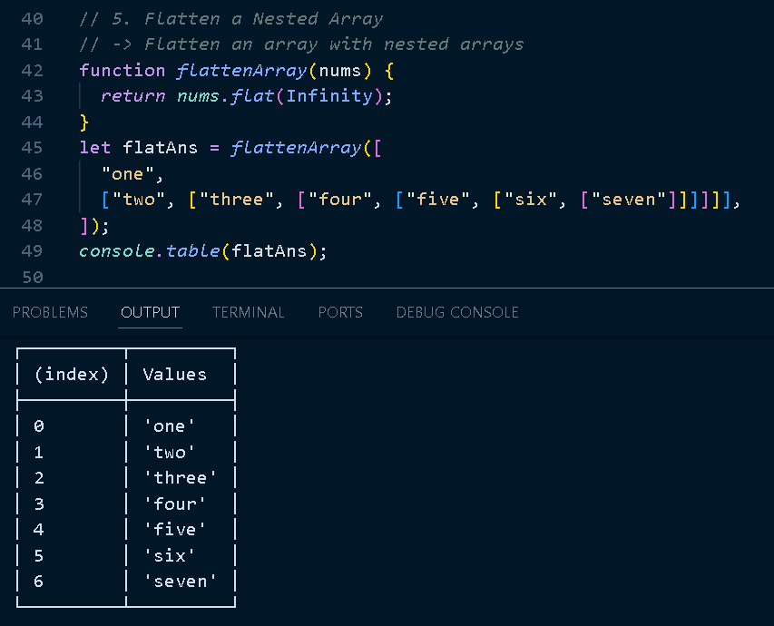
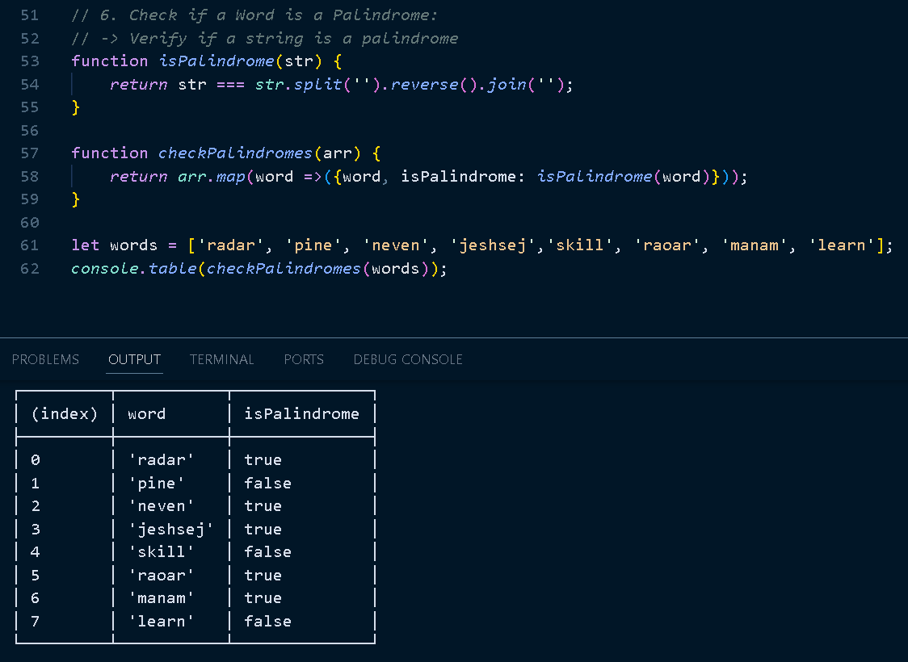
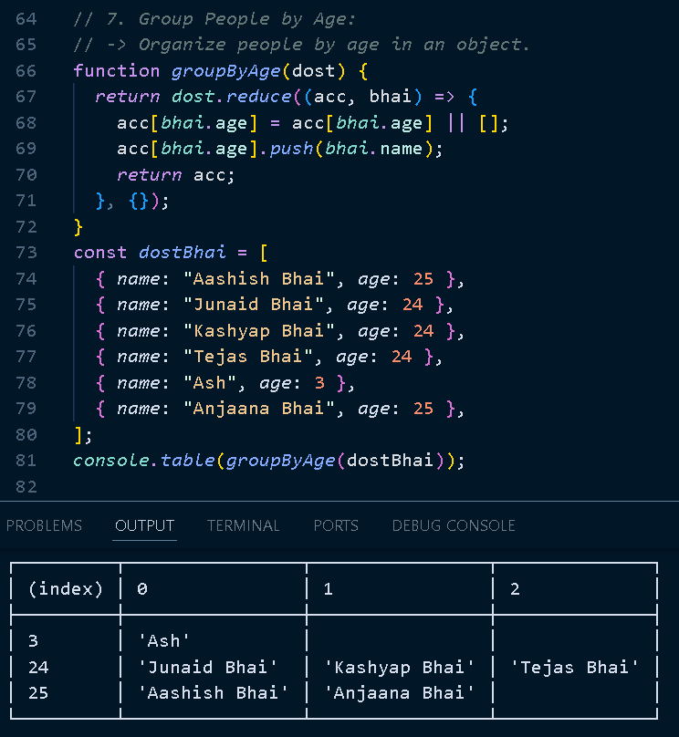
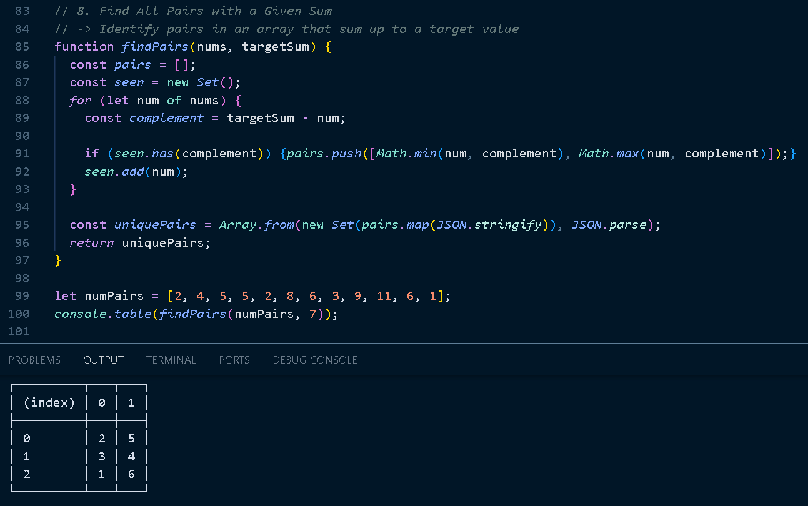
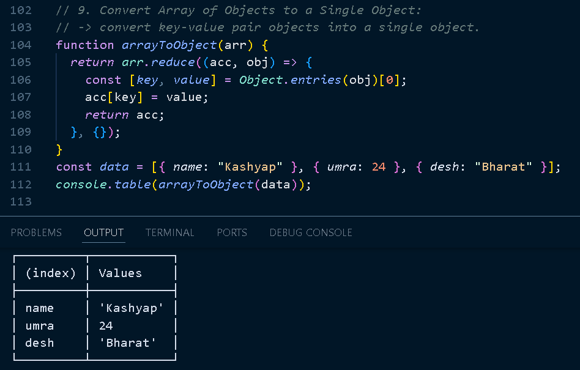

# Day 25 - JavaScript Manipulation Cardio 🏋️‍♂️

**Project Title**: Day 25 of the *30 Days of JavaScript Challenge*

This **JavaScript Manipulation Cardio** project is a focused, hands-on exercise intended to sharpen core JavaScript skills. Emphasizing array and object manipulation, it covers essential techniques such as data transformation, duplication, and organization without creating a user interface or web-based application.

---

## 📝 Project Overview

**Challenge Scope**: Practice fundamental JavaScript data manipulation techniques by completing exercises in cloning, referencing, and transforming arrays and objects.

**Goal**: Improve understanding of JavaScript’s data-handling capabilities, strengthen code efficiency, and develop problem-solving strategies.

---

## 📌 Challenges Breakdown

1. **Array Reversal**: Reverse an array while keeping the original intact.
2. **Finding Maximum Values**: Quickly locate the highest value in a set.
3. **Removing Duplicates**: Filter out repeated values in arrays.
4. **Element Counting**: Generate an object tallying the frequency of each element.
5. **Flattening Arrays**: Convert nested arrays into a flat, single-level structure.
6. **Palindrome Checker**: Determine if strings are palindromic.
7. **Property Grouping**: Sort objects into categories based on properties.
8. **Pair Identification**: Find pairs in an array that sum to a specific target.
9. **Object Conversion**: Merge an array of objects into a single, cohesive object.

---

## 📷 I/P - O/P: Preview

---

## 📂 GitHub Repository

Access the complete codebase and track updates here:
- GitHub Repository: [Js30](https://github.com/Ash-dot-coder/JavaScript_Challenge30)
- Project Repository: [Day 25: Manipulation-Cardio](https://github.com/Ash-dot-coder/JavaScript_Challenge30/tree/Js30/Day%2025%20-%20%5BManipulation-Cardio%5D)

---

## 🌐 Connect with Me

- **GitHub**: [ash-dot-coder](https://github.com/ash-dot-coder)
- **LinkedIn**: [Ayush Kohre](https://www.linkedin.com/in/aayush-kohre-dev1/)

---

## 🔑 Part of the *30 Days of JavaScript Challenge*

This project marks Day 25 of the *30 JS Challenge*, providing incremental exercises to build a strong foundation in JavaScript. 

Stay tuned for more, and keep pushing your JavaScript skills to new heights! 🏆