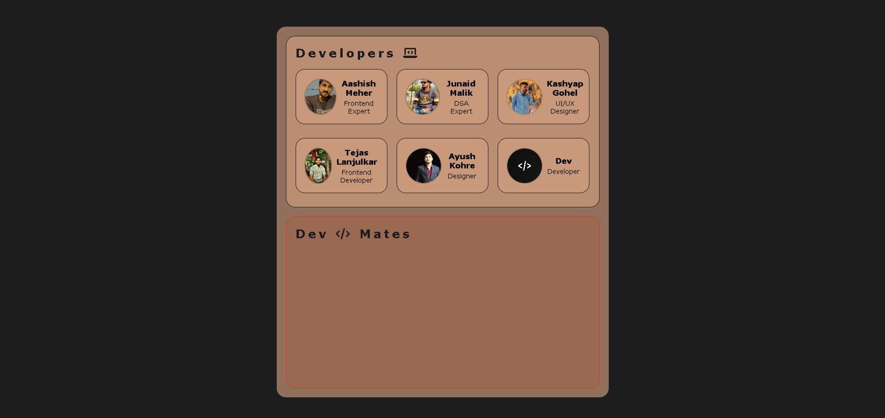
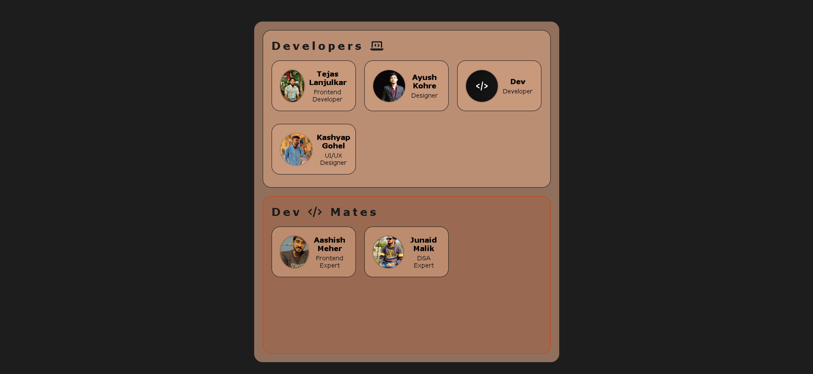

# 🖱️ Day 26 - Drag & Drop Team Members 🎉

## 📂 Repository Links
- **JS30 Repository**: [📘 JavaScript Challenge 30](https://github.com/Ash-dot-coder/JavaScript_Challenge30)
- **Current Project**: [Day 26 - Drag & Drop](https://github.com/Ash-dot-coder/JavaScript_Challenge30/tree/Js30/Day%2026%20-%20%5BDrag-Drop%5D)

## 📝 Project Overview

**Project Title**: ***Drag & Drop Team Members*** 🚀  
As part of my 30 Days JavaScript Challenge, this project showcases a dynamic drag-and-drop interface where users can easily transfer team members between different groups.

## ✨ Key Features

- **📤 Drag & Drop Interaction**: Users can drag team members from one group and drop them into another with a smooth animation.
- **💼 Team Management**: Separate sections for "Developers" and "Dev Mates" groups, enabling intuitive organization of team members.
- **🎨 Simple and Clean Design**: A minimalistic interface with hover effects, making it easy to view and manage team members.

## 📸 Visual Preview

## 📚 Technologies Used

- **🏷️ HTML5**: For structuring the interface and team member cards.
- **🎨 CSS3**: For styling and animations, such as hover effects and icon animations.
- **📜 JavaScript**: Using [Sortable.js](https://sortablejs.github.io/Sortable/) for easy drag-and-drop functionality and to handle the DOM dynamically.

## ⚙️ How It Works

This project uses JavaScript and the Sortable.js library to manage the drag-and-drop interaction:

1. **Group Management**: The two sections—"Developers" and "Dev Mates"—are created as drop zones, allowing team members to be dragged and re-ordered within or between them.
2. **CSS Animations**: Hover effects on team members and animations on icons (e.g., bouncing and rotating) add interactivity.
3. **Drag Styling**: JavaScript provides a smooth drag effect by adding specific classes to elements being moved.

## 🎯 Challenges & Learning

In this project, I:
- Practiced **JavaScript Integration with Libraries** 🔗, enhancing interactivity using Sortable.js.
- Improved **CSS Skills** 🎨 by styling for both static and dynamic states, including hover and drag.
- Explored **Event Handling in JavaScript** 🎉, managing drag and drop interactions and ensuring a smooth UX.

## 🌐 Live Demo

Experience the project live here: [🌍 Live Demo](https://ash-dot-coder.github.io/JavaScript_Challenge30/Day%2026%20-%20%5BDrag-Drop%5D/index.html)

## 🤝 Let's Connect

For any questions, feedback, or collaboration, feel free to reach out! Let’s stay connected:

- **🐙 GitHub**: [ash-dot-coder](https://github.com/ash-dot-coder)
- **💼 LinkedIn**: [Ayush Kohre](https://www.linkedin.com/in/aayush-kohre-dev1/)

---

Explore more of my **JavaScript_Challenge30** repository for additional creative projects and interactive experiences!