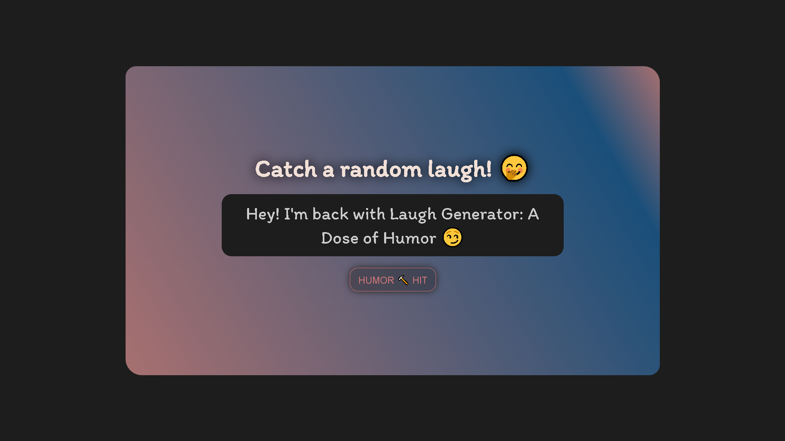
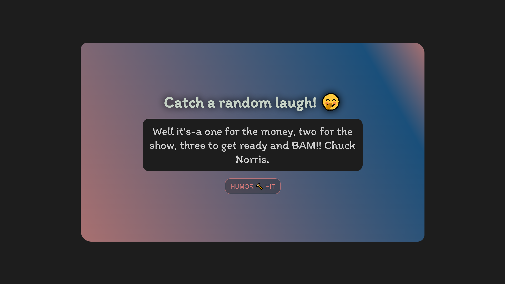

# 😂 Day 27 - Humor Hub! 🤭

## 📂 Repository Links
- **JS30 Repository**: [📘 JavaScript Challenge 30](https://github.com/Ash-dot-coder/JavaScript_Challenge30)
- **Current Project**: [Day 27 - Humor Hub](https://github.com/Ash-dot-coder/JavaScript_Challenge30/tree/Js30/Day%2027%20-%20%5BHumor-Hits%5D)

## 📝 Project Overview

**Project Title**: ***Humor Hub*** 🤣  
This project is part of my **30 JavaScript Challenge**. I created a fun and interactive random joke generator that provides a dose of humor every time you press the button. The app is built using HTML, CSS, and JavaScript to bring a lighthearted touch to the web.

## ✨ Key Features

- **🎉 Random Joke Generator**: A button that generates and displays a new joke every time it is clicked.
- **🔄 Dynamic Styling**: Animated colors and effects that keep the experience visually engaging and fun.
- **🎨 Fun and Interactive UI**: Playful design and typography that enhances the humor experience.
- **💻 Responsive Layout**: The design adapts perfectly to different screen sizes, making it user-friendly on both desktops and mobile devices.

## 📸 Visual Preview

## 📚 Technologies Used

- **🏷️ HTML5**: To structure the web page and content.
- **🎨 CSS3**: To style the layout, animations, and visual effects.
- **📜 JavaScript**: To dynamically generate and display jokes (future enhancements to be added).

## ⚙️ How It Works

The project uses a combination of HTML, CSS, and JavaScript to display a random joke when the user clicks the "Humor 🔨 Hit" button:

1. **Button Click Event**: A JavaScript event listener listens for a button click, triggering the display of a random joke.
2. **CSS Animations**: Text and background color animations add a fun and dynamic look to the app.
3. **Responsive Design**: The layout adjusts fluidly to different screen sizes using CSS media queries.

## 🎯 Challenges & Learning

Through this project, I:
- Learned how to implement **randomization** using JavaScript for dynamic content.
- Practiced **CSS animations** and **color transitions** for a more engaging user experience.
- Improved my skills in **responsive design** to ensure the app looks great on all devices.

## 🌐 Live Demo

Experience the project live here: [🌍 Live Demo](https://ash-dot-coder.github.io/JavaScript_Challenge30/Day%2027%20-%20%5BHumor-Hits%5D/index.html)

## 🤝 Let's Connect

For any questions, feedback, or collaboration, feel free to reach out! Let’s stay connected:

- **🐙 GitHub**: [ash-dot-coder](https://github.com/ash-dot-coder)
- **💼 LinkedIn**: [Ayush Kohre](https://www.linkedin.com/in/aayush-kohre-dev1/)

---

Explore more of my **JavaScript_Challenge30** repository for additional creative projects and interactive experiences!