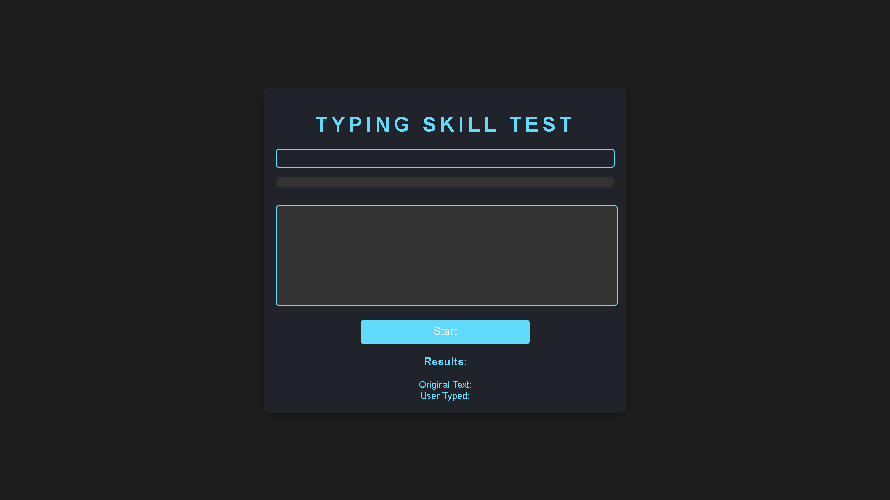
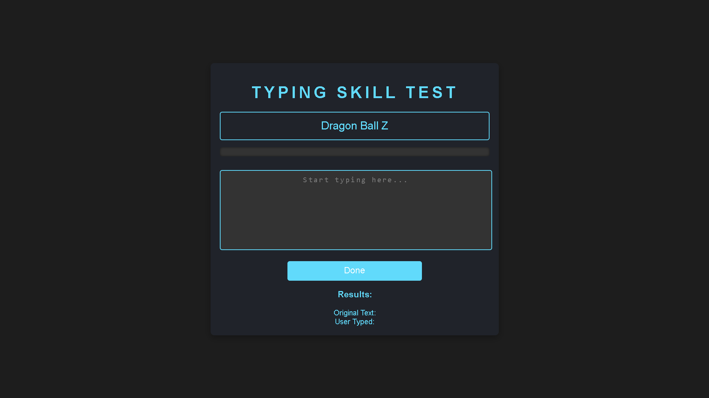
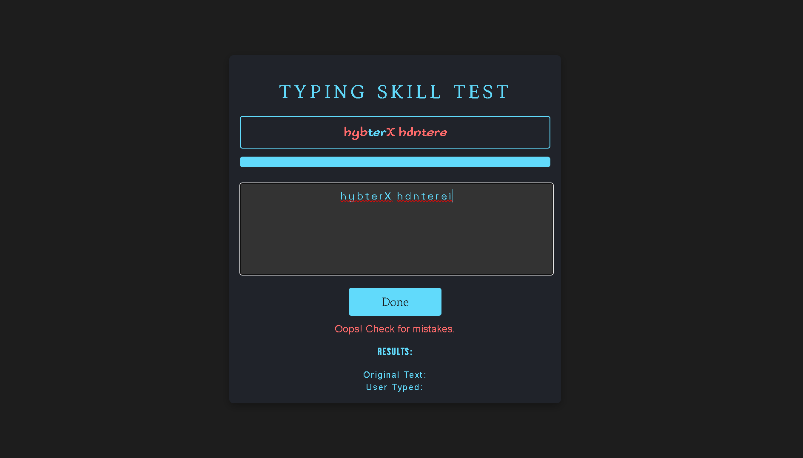
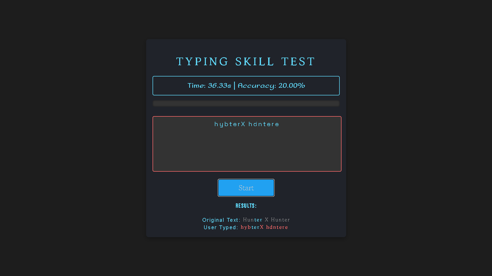
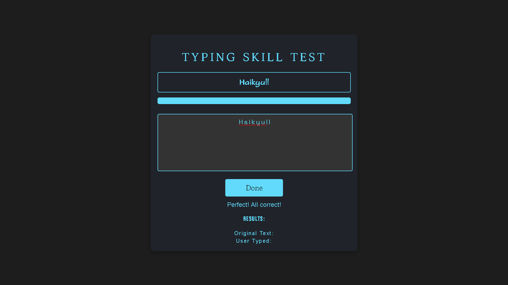
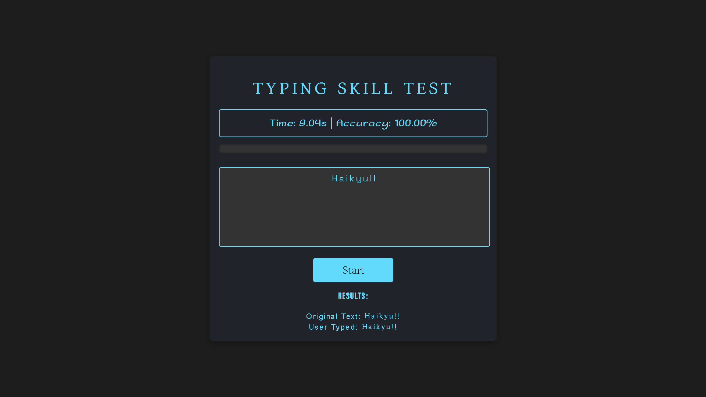

# ⌨️ Day 28 - Typing Skill Test 🎯

## 📂 Repository Links
- **JS30 Repository**: [📘 JavaScript Challenge 30](https://github.com/ash-dot-coder/JavaScript_Challenge30)
- **Current Project**: [Day 28 - Typing Skill Test](https://github.com/ash-dot-coder/JavaScript_Challenge30/tree/Js30/Day%2028%20-%20%5BTyping-Skill-Test%5D)

## 📝 Project Overview

**Project Title**: ***Typing Skill Test*** 🚀  
As part of my 30 Days JavaScript Challenge, this project tests typing speed and accuracy in a fun, interactive way with anime-themed prompts.

## ✨ Key Features

- **Real-Time Feedback**: Highlights correct and incorrect letters as you type, providing instant feedback.
- **Progress Tracking**: A visual progress bar that updates dynamically based on typing accuracy.
- **Accuracy and Time Measurement**: Displays your typing time and accuracy percentage upon completion.
- **Engaging Prompts**: Anime-themed phrases for a unique typing experience.

## 📸 Visual Preview

## 📚 Technologies Used

- **🏷️ HTML5**: Structured the typing interface and progress display.
- **🎨 CSS3**: Styled feedback highlights and the dynamic progress bar.
- **📜 JavaScript**: Manages typing logic, feedback, progress tracking, and accuracy calculation.

## ⚙️ How It Works

This project uses JavaScript to handle the typing test’s core functionality:

1. **Prompt Display and Animation**: Displays a random typing prompt with a typewriter effect animation.
2. **Real-Time Typing Check**: Compares user input against the prompt text, providing instant feedback with color-coded highlights.
3. **Completion Feedback**: Calculates the time taken and accuracy percentage when the typing test is completed.

## 🎯 Challenges & Learning

In this project, I:
- Practiced **DOM Manipulation** with JavaScript to display real-time typing feedback.
- Improved **CSS Animation Skills** by adding color highlights and a typewriter animation.
- Explored **Performance Measurement** using `performance.now()` for accurate typing time.

## 🌐 Live Demo

Experience the project live here: [🌍 Live Demo](https://ash-dot-coder.github.io/JavaScript_Challenge30/Day%2028%20-%20%5BTyping-Skill-Test%5D/index.html)

## 🤝 Let's Connect

For any questions, feedback, or collaboration, feel free to reach out! Let’s stay connected:

- **🐙 GitHub**: [ash-dot-coder](https://github.com/ash-dot-coder)
- **💼 LinkedIn**: [Ayush Kohre](https://www.linkedin.com/in/aayush-kohre-dev1/)

---

Explore more of my **JavaScript_Challenge30** repository for additional creative projects and interactive experiences!