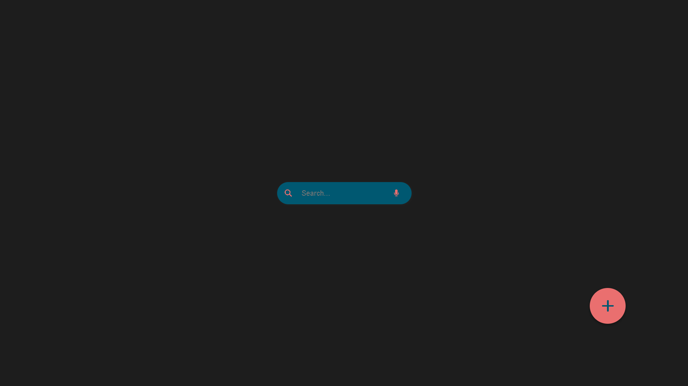
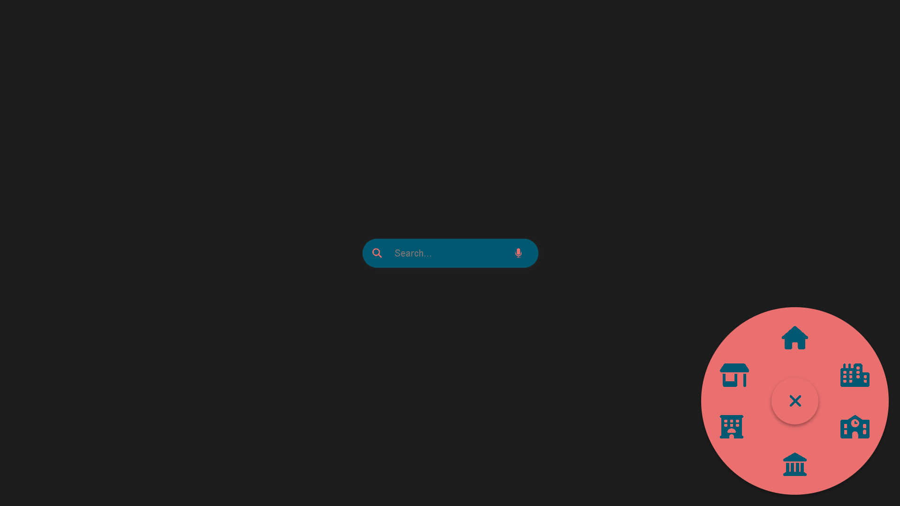
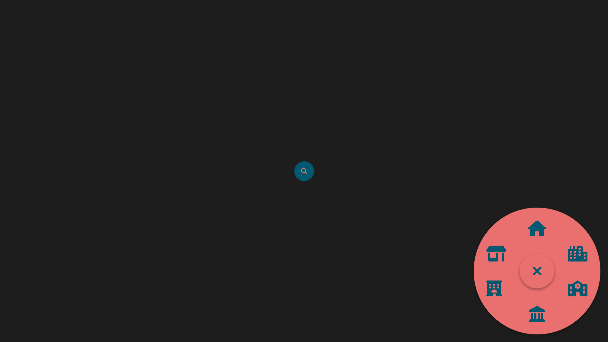
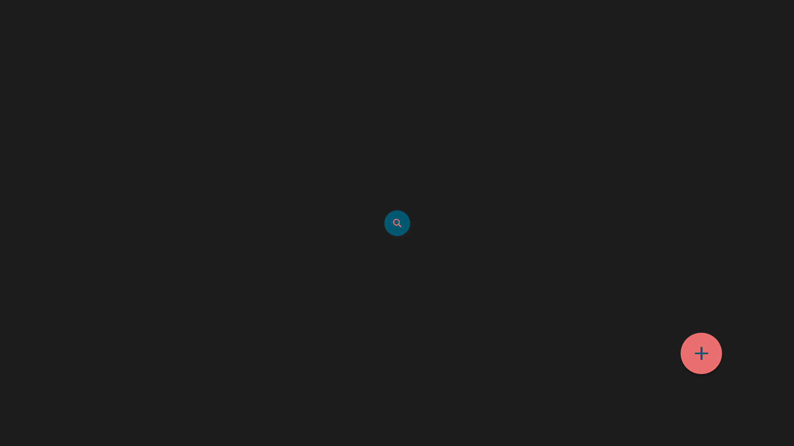

# 🔍 Day 29 - Search Motion & Rounded Navbar 🧭

## 📂 Repository Links
- **JS30 Repository**: [📘 JavaScript Challenge 30](https://github.com/Ash-dot-coder/JavaScript_Challenge30)
- **Current Project**: [Day 29 - Search Motion & Rounded Navbar](https://github.com/Ash-dot-coder/JavaScript_Challenge30/tree/Js30/Day%2029%20-%20%5BSearch-Motion_Rounded-Navbar%5D)

## 📝 Project Overview

**Project Title**: ***Search Motion & Rounded Navbar***  
This project is part of my **30 JavaScript Challenge**, where I focus on building a visually dynamic and interactive **search bar with smooth animations** and a **rounded navbar** with expanding functionality. It combines **HTML**, **CSS**, and **JavaScript** for seamless user interaction and a clean, modern UI.

## ✨ Key Features

- **🔍 Animated Search Motion**: A search bar with a magnifying glass icon that smoothly expands and retracts with an animation effect.
- **🧭 Interactive Rounded Navbar**: A circular navbar positioned at the bottom-right corner that expands to reveal navigation icons upon clicking the central button.
- **💡 Intuitive UI Design**: Elegant, responsive design and animations that provide a clean user experience.
- **📱 Responsive Layout**: Adjusts fluidly across screen sizes for both desktop and mobile views.

## 📸 Visual Preview

## 📚 Technologies Used

- **🏷️ HTML5**: For creating the structure and layout.
- **🎨 CSS3**: For styling, animations, and responsive design.
- **📜 JavaScript**: To handle dynamic interactions such as toggling animations and navbar expansion.

## ⚙️ How It Works

The project brings together a search bar and a rounded navbar with smooth animations, enhancing user interactivity:

1. **Search Motion**:
   - Clicking the magnifying glass icon expands the search bar smoothly and reveals the microphone icon, allowing users to type their query.
   - The `.active` CSS class manages the expanding effect, while JavaScript toggles visibility.
   
2. **Rounded Navbar**:
   - Positioned at the bottom-right corner, the navbar expands in a circular motion when the button is clicked, revealing navigation icons arranged around the central button.
   - JavaScript adds the `.change` class, which triggers CSS animations for the expanding effect.

3. **Responsive Design**:
   - CSS media queries ensure that both components adapt to various screen sizes, maintaining usability on both desktop and mobile devices.

## 🎯 Challenges & Learning

Through this project, I:
- Enhanced my understanding of **CSS transitions and animations** to create smooth expanding and retracting effects.
- Practiced **JavaScript event handling** to toggle classes and manage dynamic states.
- Further developed skills in **responsive design** to ensure accessibility and usability on all device types.

## 🌐 Live Demo

Experience the project live here: [🌍 Live Demo](https://ash-dot-coder.github.io/JavaScript_Challenge30/Day%2029%20-%20%5BSearch-Motion_Rounded-Navbar%5D/index.html)

## 🤝 Let's Connect

If you have any questions, feedback, or would like to collaborate, feel free to reach out! Let's stay connected:

- **🐙 GitHub**: [ash-dot-coder](https://github.com/ash-dot-coder)
- **💼 LinkedIn**: [Ayush Kohre](https://www.linkedin.com/in/aayush-kohre-dev1/)

---

Check out my **JavaScript_Challenge30** repository for more innovative projects and UI challenges!