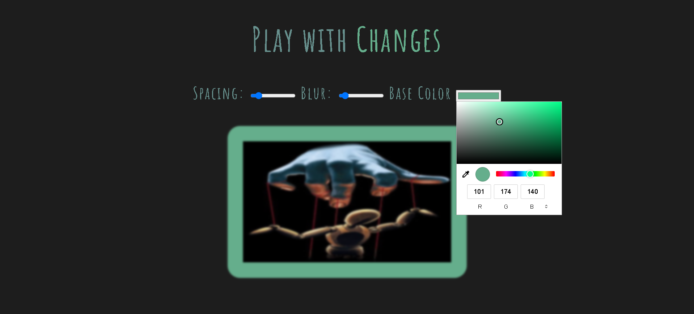

# JavaScript Challenge 30 🚀

Welcome to my **JavaScript Challenge 30**, where I am enhancing my JavaScript skills through various projects over 30 days. Each day focuses on a different project, showcasing different functionalities and learning outcomes.

## Day 3 - Visual Tuner 🎨

Welcome to my **Day 3 project** of the JavaScript Learning Challenge! In this project, I developed an interactive tool called **Visual Tuner**, allowing users to manipulate various visual aspects of an image in real-time. 

## Project Overview

**Visual Tuner** provides a dynamic interface where users can adjust:
- **Spacing**: Modify the margins and padding around the image.
- **Blur Effect**: Control the intensity of the blur applied to the image.
- **Base Color**: Change the color of the text and frame dynamically.

This project showcases the capabilities of JavaScript and CSS to create engaging and interactive web experiences.

## Features

- **Real-Time Updates**: Adjustments to spacing, blur, and color are applied instantly, providing immediate visual feedback.
- **User-Friendly Interface**: Sliders and color pickers offer an intuitive way to explore various effects.
- **Responsive Design**: The tool is designed to work seamlessly across different devices and screen sizes.

## Look

 

### How to Use
1. Clone the repository:
   ```bash
   git clone https://github.com/Ash-dot-coder/JavaScript_Challenge30.git   
   ```

2. Navigate to the project directory:
    ```cd JavaScript_Challenge30/Day 3 - [Visual-Tuner]
    ```
3. Open the index.html file in your preferred web browser.

## 🔧 Technologies Used
- HTML: Structure of the application
- CSS: Styling and layout
- JavaScript: Functionality and interactivity

## 📦 Features
- Real-time Updates: All visual changes are applied instantly as users interact with the controls.
- User-Friendly Interface: The design is intuitive, making it easy for anyone to use.
- Cross-Browser Compatibility: Works seamlessly on modern web browsers.

## 🛠️ Installation
To run the project locally:

- Ensure you have a modern web browser installed (Chrome, Firefox, Safari, etc.).
- Follow the Getting Started section to clone and navigate to the project directory.
- Open the index.html file to view the project in action.

## 🌟 Acknowledgements
A special thanks to Wes Bos for providing invaluable resources and insights throughout this challenge. His teaching has been instrumental in my learning journey.

## 💬 Contact
Feel free to reach out for feedback, suggestions, or questions!

GitHub: [ https://github.com/Ash-dot-coder ]
Email: [kohreaayush@gmail.com]