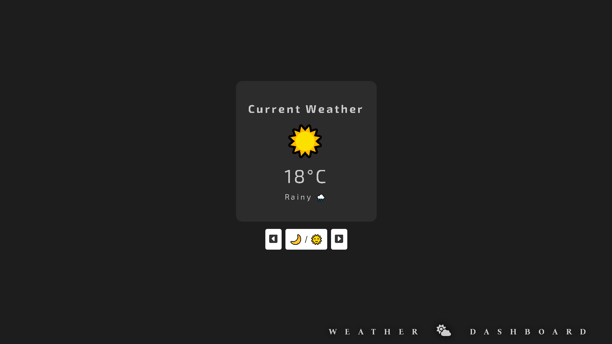
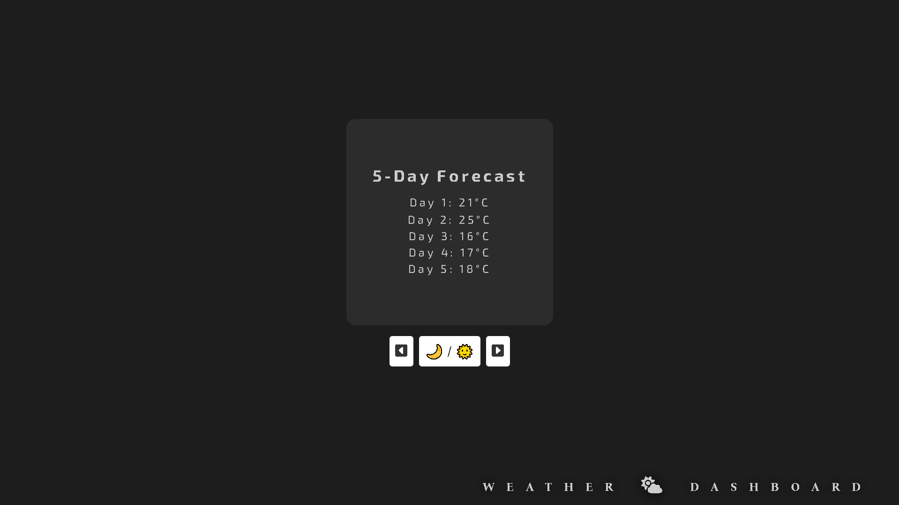
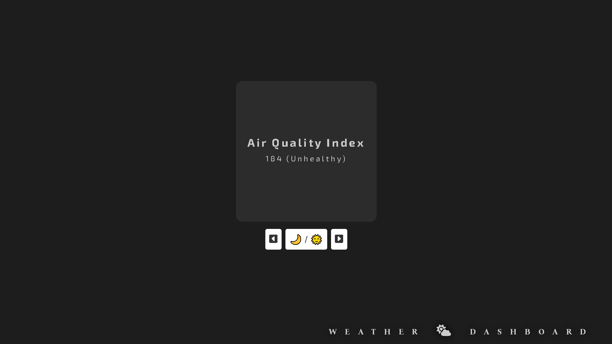
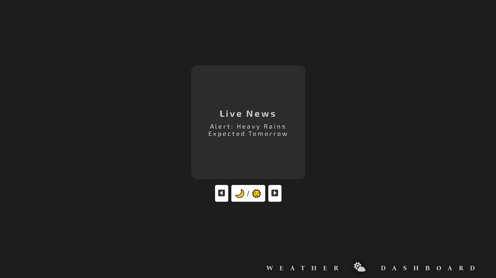
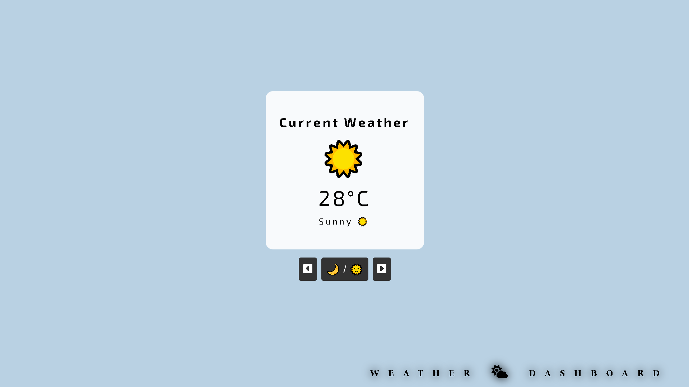
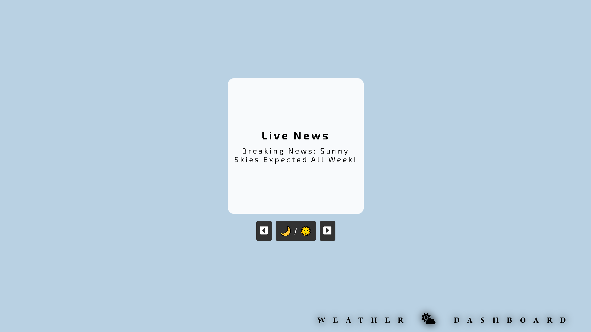

# 🌤️ Day 30 - Weather Dashboard 🌦️

## 📂 Repository Links
- **JS30 Repository**: [📘 JavaScript Challenge 30](https://github.com/Ash-dot-coder/JavaScript_Challenge30)
- **Current Project**: [Day 30 - Weather Dashboard](https://github.com/Ash-dot-coder/JavaScript_Challenge30/tree/Js30/Day%2030%20-%20%5BWeather-Dashboard%5D)

## 📝 Project Overview

**Project Title**: ***Weather Dashboard***  
This project is part of my **30 JavaScript Challenge**, where I focus on creating an interactive **Weather Dashboard**. It allows users to see static weather information, including the current weather, a 5-day forecast, air quality index, and live news, all presented in an engaging and visually dynamic dashboard. While the weather information is pre-defined for the sake of this project, it simulates a real-world weather dashboard layout, allowing users to interact with different sections for a better user experience.

## ✨ Key Features

- **🌍 Current Weather**: Displays static weather data for a predefined city, including temperature (e.g., 24°C) and weather condition (e.g., Sunny).
- **📅 5-Day Forecast**: Shows a simulated 5-day forecast with daily temperature and condition.
- **🌬️ Air Quality Index**: Presents the air quality index (e.g., AQI 55, labeled as 'Good'), simulating air quality data.
- **📰 Live News**: Displays a sample news headline related to weather, such as "Sunny Skies Expected All Week!"
- **🧭 Interactive Controls**: Users can rotate through different sections of the dashboard (weather, forecast, air quality, and news) with buttons to navigate.
- **🌙 Dark/Light Mode Toggle**: Provides a toggle to switch between dark and light themes for the dashboard.
- **📱 Responsive Layout**: Adjusts fluidly across desktop and mobile devices to ensure accessibility and ease of use.

## 📸 Visual Preview

## 📚 Technologies Used

- **🏷️ HTML5**: For creating the layout and structure of the weather dashboard.
- **🎨 CSS3**: For styling the dashboard, including responsive design and visual effects.
- **📜 JavaScript**: To simulate functionality for weather data and interactive elements like theme toggling and rotating through sections.

## ⚙️ How It Works

This project simulates the functionality of a weather dashboard by showing predefined data:

1. **Current Weather**:
   - Displays the current weather condition (e.g., sunny) and temperature (e.g., 24°C).
   - Simulated using static values to demonstrate how real-time weather information would be presented.

2. **5-Day Forecast**:
   - Shows a static 5-day weather forecast, including temperature and general weather conditions for each day.

3. **Air Quality Index**:
   - Displays the air quality index (e.g., AQI of 55), and visualizes the air quality level (labeled as "Good").

4. **Live News**:
   - Presents a simulated news headline related to weather (e.g., "Sunny Skies Expected All Week!").

5. **Interactive Controls**:
   - Users can navigate between different sections of the dashboard (current weather, forecast, air quality, and news) by rotating the cube using buttons on the control panel.
   - A dark/light mode toggle allows users to switch between dark and light themes.

6. **Responsive Design**:
   - CSS media queries ensure that the dashboard is responsive and adapts to different screen sizes, providing a smooth experience on both desktop and mobile devices.

## 🎯 Challenges & Learning

Through this project, I:
- Simulated how weather dashboards work, showing static data in a clean and interactive layout.
- Gained experience with **CSS animations and transitions**, including rotating and toggling visual elements.
- Improved my skills in **JavaScript event handling** to manage interactions like theme toggling and section rotation.
- Refined my **responsive design** skills, ensuring that the dashboard adapts to various screen sizes seamlessly.

## 🌐 Live Demo

Experience the project live here: [🌍 Live Demo](https://ash-dot-coder.github.io/JavaScript_Challenge30/Day%2030%20-%20%5BWeather-Dashboard%5D/index.html)

## 🤝 Let's Connect

If you have any questions, feedback, or would like to collaborate, feel free to reach out! Let's stay connected:

- **🐙 GitHub**: [ash-dot-coder](https://github.com/ash-dot-coder)
- **💼 LinkedIn**: [Ayush Kohre](https://www.linkedin.com/in/aayush-kohre-dev1/)

---

Check out my **JavaScript_Challenge30** repository for more innovative projects and UI challenges!